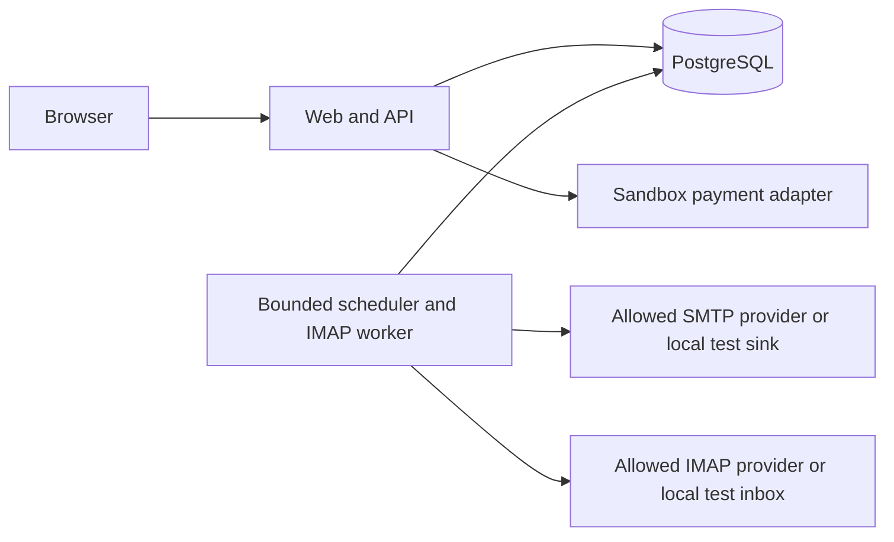

# Architecture — N7 v1

## Architecture Overview

Distributed Monolith in project monorepo. Docker Compose deployment on existing
VPS, separate N7 network and volumes. No changes to shared proxy without approval.

## Component Breakdown / Technology Stack

| Layer | Choice | Rationale |
|---|---|---|
| Frontend | Accessible server shell + TypeScript interactive cabinet based on CJM A | Small MVP, full loading/error/consent states, no external UI assets |
| Backend | Node 22, TypeScript, bounded HTTP routing/domain services | Reuse donor native crypto/pg patterns, explicit validation |
| Database | PostgreSQL 16 container | Durable jobs, atomic quota, tenant data, unique idempotency keys |
| Cache | None initially | Avoid second authority for consent/quota |
| Queue | PostgreSQL jobs and SKIP LOCKED | Shared transaction for claim, consent and limits |
| Worker | Separate Node process/container using same domain package | Scheduled warmup and bounded IMAP ingestion |
| Infrastructure | Docker Compose, loopback-only web port variable | Isolated ownership; DB expose only, no host mapping |
| Test browser | Existing codex-ui-playwright 1.63.0 | Owner-required shared browser; isolated contexts/artifacts |

Project owns package.json and package-lock.json; root manifests untouched. Sol
proposes dependency edits, N7 integration owner reconciles final project lock.
No product LLM call required; no LLM secret is copied merely because available.

## Tenant / credential boundaries

ADR-001: credential encryption server-side required by background operation,
approved in OWN-N7-002. Separate runtime secrets for sessions, credential
AEAD and unsubscribe signing; keys never in DB, repo, API or logs. Mailbox AAD
prevents swapping ciphertext across tenants. Key-version enables explicit rotation.
Web cannot return decrypted credentials. Worker logs opaque IDs and typed errors.
Provider endpoints are operator allowlisted and IP-validated/pinned at connect time.

Tenant predicates are mandatory on every owner query; jobs carry server-derived
tenant. Cross-tenant pool selection happens only inside scheduler and returns
no peer email to dashboard. Pool participation needs recipient and sender consent.
Use account-scoped transaction helpers; independent tests use two tenants.

## External Dependencies

Checked 2026-10-02; quotes are short excerpts from opened primary documentation.

| Capability needed | Provider / API | Evidence | Verdict | Requirements relying on it |
|---|---|---|---|---|
| SMTP transport with enforced TLS | Nodemailer against compatible SMTP server | [SMTP docs](https://nodemailer.com/smtp): “Nodemailer requires a STARTTLS upgrade” · checked 2026-10-02 | CONFIRMED | FR-n7-002, FR-n7-005 |
| IMAP connect/read mailbox | ImapFlow against compatible IMAP server | [Quick Start](https://imapflow.com/docs/getting-started/quick-start/): “await client.connect()” · checked 2026-10-02 | CONFIRMED | FR-n7-002, FR-n7-006 |
| Live sending permission for a concrete mailbox/provider | Operator-selected provider | No live credentials or provider account policy checked yet | UNCONFIRMED | Live activation only, deferred out of initial local MVP acceptance |
| Provider complaint feed | Provider-specific adapter | No concrete provider selected; manual authenticated operator intake used locally | UNCONFIRMED | Automated live provider complaint intake deferred; FR-n7-007 uses local operator path |
| Live payment capture | Payment provider | Not invoked; sandbox adapter candidate from reuse-inventory.md; provider contract verification required before enabled sandbox | UNCONFIRMED | Live charge excluded; FR-n7-009 unavailable state accepted until sandbox contract verified |

CONFIRMED library capability does not confirm a particular account's auth method,
terms, deliverability or complaint feed. Optional live capabilities do not silently
become required without an updated plan. Yahoo source fetch failed and is not cited
as confirmed. No managed database substitutes are used.

## Data / operations

Schema entities and invariants: Pseudocode.md. DB migrations forward-only schema
changes; no destructive data migration in MVP. DB backup/restore instructions and
readiness probes before deployment. Auth/consent/event audit retained without body
or credentials. Local fake provider fixtures never appear as live observations.

SMTP boundary: durable submitting record before socket call. Exactly-once SMTP
delivery cannot be guaranteed; crash/timeout after submission becomes unknown_delivery.
Safety ceiling uses attempted/submitted reservations, not only success responses.
Replies/suppression cancel queued steps; already submitting messages cannot be recalled.

ADR-002 default deny/live gate; ADR-003 seed eligibility; ADR-004 verified billing;
ADR-005 donor provenance. CPU limit 2 for tests, no parallel heavy builds with root.

## Decision Traceability

ADR-001 → FR-n7-002; ADR-002 → FR-n7-003/005; ADR-003 → FR-n7-004/008;
ADR-004 → FR-n7-009/FR-GROWTH-002; ADR-005 → FR-n7-001/NFR-n7-001.
These links establish named coverage, not implemented behavior.
