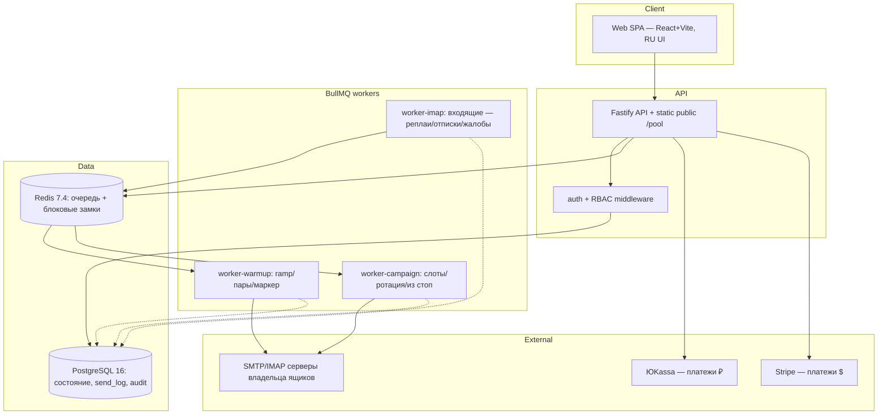

# Architecture — Грелка (N7)

Дата: 2026-10-07. Ограничения: VPS + Docker Compose (курс N4–N6), SMTP/IMAP без OAuth (постановка),
 RU первый, $ второй (решение владельца). Ключи — [Specification.md](Specification.md), алгоритмы —
[Pseudocode.md](Pseudocode.md).

## Architecture Overview

**Стиль:** разделённый монолит: единый Fastify-приложение (HTTP API) + отдельные worker-контейнеры
на общей PostgreSQL и Redis-очереди (BullMQ). Это ной стилизованный «Distributed Monolith» курса:
роли физически разделены (retry-домены изолированы), состояние — только в Postgres/Redis.

Инвариант трассы отправки: каждая отправка (и прогрев, и кампания) идёт через очередь и стоп-лист
(FR-SEC-001/004) — обходного пути не существует.

## Component Breakdown

| Компонент | Контейнер | Ответственность (ключи) | Замечания |
|---|---|---|---|
| `apps/web` | web (React+Vite SPA) | UI: онбординг, дашборд, форм кампаний, тарифы, /pool-публичная | обращается только к API; секретов и ключей нет |
| `apps/api` | api | HTTP, RBAC, pre-flight, деньги checkout, вебхуки | Bearer JWT; rate-limit NFR-SEC-003 |
| `apps/worker-warmup` | worker | FR-POOL-002/003, FR-WARMUP-001..003, расшифровка секретов | единственный consumer секретов |
| `apps/worker-campaign` | worker | FR-CAMP-002..006, заголовки List-Unsubscribe в письмах | то же |
| `apps/worker-imap` | worker | FR-CAMP-005, FR-SEC-001/002/003: классификация входящих | метаданные only (NFR-PRIV-001) |
| `packages/queue` | (обёртка BullMQ) | донор N6 packages/queue: фенс попыток, ретраи | из проекта 06 |
| `packages/db` | (модели/драйвер pg) | миграции, структура и индексы (стоп-лист — уникальный индекс адреса) | донор-стиль N6 db |
| `packages/secrets` | (модуль) | AES-256-GCM envelope | ключи только env |
| `packages/shared` | (Zod-схемы) | общие типы API | — |

## Technology Stack

| Layer | Technology | Rationale |
|---|---|---|
| Frontend | React 18 + Vite + TypeScript | SPA, лёгкий деплой, курсовой контекст N1–N6 |
| Backend | Node.js 20 + TypeScript + Fastify | единый язык с фронтом, быстрый HTTP, Zod-валидация |
| Database | PostgreSQL 16 | транзакциональность очередей квот, уникальность idempotency-ключей |
| Cache/Queue | Redis 7.4 + BullMQ | распределённые локи и очередь; донор packages/queue N6 |
| Workers | 3 контейнера-процесса на одной кодовой базе | изоляция ретраев; масштабирование отдельно по типу нагрузки |
| Payments | ЮKassa API (₽) + Stripe Billing ($) | контур владельца; donor N1 для ЮKassa |
| Infrastructure | Docker Compose на VPS, Caddy на TLS | стиль N4–N6; Caddy домена + static /pool |
| Testing | Vitest + Testcontainers (Postgres/Redis) + Playwright | unit/интеграция/E2E (Refinement.md) |
| Observability | pino-JSON логи + /metrics Prometheus | Completion.md |

## External Dependencies

Правило модуля: одна строка на *возможность* (capability), не на вендора; цитаты — из документации
самого провайдера с датой проверки (2026-10-07).

| Capability needed | Provider / API | Evidence (цитата + дата) | Verdict | Requirements |
|---|---|---|---|---|
| приём онлайн-платежей ₽ (создание платежа, вебхуки, идемпотентный ключ) | ЮKassa API v3 | https://yookassa.ru/developers/api — «The YooMoney API Reference describes all the YooMoney API methods. The API allows you to process online payments via different methods», «Interaction format: … requirements for request authentication and idempotency key», «Incoming notifications … (webhook, callback) sent to track object statuses» · проверено 2026-10-07 | CONFIRMED | FR-BILL-002, FR-BILL-004 |
| подписочные платежи $ и вебхуки статусов | Stripe Billing / Checkout | https://docs.stripe.com/billing/subscriptions — «Subscriptions let customers make recurring payments to access a product or service. When you create a subscription, Stripe automatically generates invoices, attempts payment collection, and manages the subscription status throughout its lifecycle», «You can use webhook events to monitor and handle transitions between statuses.» · проверено 2026-10-07 | CONFIRMED | FR-BILL-003, FR-BILL-004 |
| SMTP/IMAP отправки-чтения ящиков | серверы почтовых провайдеров ВЛАДЕЛЬЦА (Gmail/Workspace, Яндекс, прочие) | не наш внешний сервис: возможности предоставляет провайдер владельца; наши гарантии — TLS-only и fail-closed (NFR-SEC-002, FR-MAILBOX-001) | N/A (dependency-of-user) | FR-MAILBOX-001, FR-WARMUP-002, FR-CAMP-005 |
| разрешение DNS-записей (SPF/DKIM/DMARC) | системный резолвер ОС | публичные зоны; ограничения провайдера не выявлены | N/A (инфраструктура ОС) | FR-DOMAIN-001 |

Легенда вердиктов: CONFIRMED/UNCONFIRMED/CONTRADICTED (закрытый набор модуля); для двух строк
допустимо N/A — когда зависимость НЕ внешний сервис: «dependency-of-user» (SMTP/IMAP ящиков
владельца) и «инфраструктура ОС» (DNS-резолвер).

Откровенная оговорка (честность профиля): возможности ЮKassa и Stripe выше — подтверждены цитатами
их дока; сам инвентарь (какие методы именно используем) зафиксирован в Pseudocode API Contracts.

## Data Architecture

Хранение: PostgreSQL — единственный источник состояния; Redis — очередь/локи только (потеря Redis
переживается реконструкцией очередей из таблиц состояний: warmup_pair, send_log, campaign).
Связи: user 1–N domain 1–N mailbox 1–0..1 pool_membership; domain 1–N health_snapshot;
user 1–N campaign 1–N campaign_step, 1–N recipient; campaign 1–N send_log; mailbox 1–N send_log;
stoplist_entry — глобальный (по адресу); user 1–1 subscription; user 1–0..1 attribution; partner_code
1–N commission_event. Логика поля-типов — Pseudocode §Data Structures (реестр единственный):
e.g.Enum статусов mailbox и campaign указаны там; здесь двойной список не ведётся.

## Security Architecture

- **Аутентификация:** email+пароль (Argon2id), подтверждение email, JWT access 15 мин + refresh 30
  дней (session.refresh_hash). Доноры: 03a lib/auth, N1 login/current-session.
- **RBAC:** роль owner владеет только своими ресурсами (user_id на всех приватных запросах);
  admin — только операционные действия платформы.
- **Секреты:** AES-256-GCM envelope (Pseudocode: Encrypt mailbox secrets); мастер-ключ KEK — env,
  в БД и логах отсутствует; расшифровка — только worker-warmup/worker-campaign/worker-imap.
- **Согласия:** все действия от имени (пул, запуск кампании) — отдельные записи с текстом+версией в
  audit_log (append-only) — паттерн постановки (не «кнопка-и-забыл»).
- **Email-обработка:** содержимое входящих не хранится (NFR-PRIV-001); стоп-лист — глобальный
  (FR-SEC-001), отписка ≤ 48 ч SLA (FR-SEC-002), жалоба → автопауза (FR-SEC-003).
- **Rate-limit/DoS:** 100 req/min/IP+аккаунт, burst-бюджет; отправка — только через очередь.
- **TLS:** исходящие SMTP — TLS-only (465/STARTTLS, NFR-SEC-002); вход API — Caddy TLS; вебхуки —
  фиксированные пути с проверкой источника/подписи.

## Scalability Considerations

- API — stateless, реплики за балансировкой (session в Redis).
- Workers — отдельные реплики по типу (warmup/campaign/imap — разные очереди BullMQ), их «мягкое»
  ограничение — окна SMTP ящиков (внешнее) и limit-конвенция.
- Bottleneck 1: IMAP-коннекции (1 ящик — 1 постоянная или poll-связь) — вертикальный потолок, для
  25–300 ящиков хватает.
- Bottleneck 2: очередь—serialized в PG; на неделю курсовой нагрузки запас велик.

## Reconciliation with Pseudocode

| Сущность.поле | Вид расхождения | Что сделано |
|---|---|---|
| none | — | — |

Расхождений с [Pseudocode.md](Pseudocode.md) не найдено. Сверены сущности: user, session, domain,
mailbox, pool_membership, warmup_plan, warmup_pair, campaign, campaign_step, recipient, send_log,
stoplist_entry, inbound_event, health_snapshot, partner_code, attribution, commission_event,
subscription, billing_event, audit_log; алгоритмы: Register and authenticate, Verify domain DNS,
Connect mailbox with live probe, Encrypt mailbox secrets, Join pool with consent, Build daily
warmup plan, Select warmup pair, Dispatch warmup email, Import recipients with stop screen,
Validate chain, Schedule campaign slots, Dispatch campaign email, Launch campaign with preflight,
Process inbound event, Apply stoplist with 48h SLA, Auto-pause on complaints, Compute health
score, Create billing checkout, Process billing webhook, Attribute partner referral.

## Reuse из проектов 01–06 (инвентарь)

| Донор (путь) | Что | Как адаптируем | Проверка |
|---|---|---|---|
| `01-testimonials-senja/apps/web/src/lib/payment.ts` | ЮKassa payment + webhook-аутентичность (IP-сети + перезапрос статуса), isPaid/extendPaidUntil (tariff.ts) | перенос в packages: `payments/yookassa.ts`; webhook route в api | unit: дедуп payload_id, fake-webhook 403 |
| `01-testimonials-senja/apps/web/src/lib/agent-payments/` | события выплат, история, уведомления | v1.0 — FR-PARTNER-003; в MVP только read-only | — |
| `03a-affiliate-rewardful/apps/web/src/lib/auth/` | email+password/session-модуль | под Fastify + Argon2 (донор уже Argon2/JWT-стиль) | login/logout unit + интеграция refresh |
| `03a-affiliate-rewardful` (referral-логика) | коды и атрибуция до оплаты | packages: `partner/attribution.ts` (90 дней, self-referral, «нет фолбэка на cookie при ручном коде» — Specification US-010) | unit: SC-US-010-1..3 |
| `06-rag-sales-chatbase/packages/queue` | BullMQ-обёртка с фенсом попыток | packages/queue как есть (пути/имена job — новые) | stalled/fence unit |
| Compose-уроки N4–N6 | деплой-скелет: api/worker/web раздельными контейнерами | docker-compose.yml N7 | run: `docker compose up -d` + healthz |
| Чего НЕТ среди доноров | Stripe-интеграция, IMAP-поллер, DNS-проверка | новое; ссылки на docs в External Dependencies | per кейс |

## Здравый вид решения (ADR-мосты)

Краткие решения со следами: [ADR.md](ADR.md) (AD-001…AD-006): разделённый monolith + BullMQ,
envelope-секреты, единый глобальный пул, Fastify+React+Vite, TLS-only SMTP, двухпровайдерные
платежи через общий интерфейс BillingProvider.
