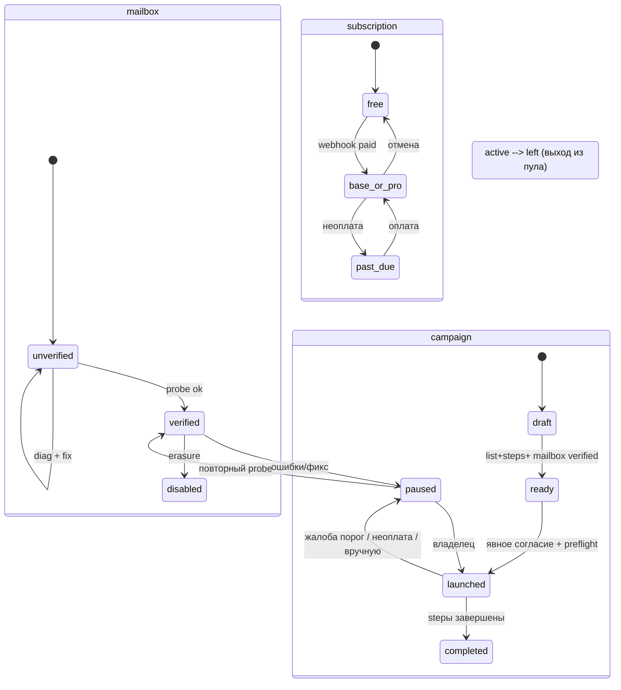

# Pseudocode — Грелка (N7)

Дата: 2026-10-07. Ключи требований — из [Specification.md](Specification.md); сценарии —
`SC-<US-id>-<n>`. Логическая модель до выбора хранилища; физическое хранилище — Architecture.md.

## Data Structures

Все сущности: `id: UUID` (PK, gen_random_uuid()), `created_at: Timestamp` (default now).

### user
- id: UUID · email: Text (unique, lowercase) · password_hash: Text (Argon2id) · email_confirmed_at: Timestamp | null
- role: Enum('owner','agency','admin') — S2 не отдельная таблица; роль
- created_at: Timestamp

### session
- id: UUID · user_id: UUID → user · refresh_hash: Text · expires_at: Timestamp · created_at: Timestamp

### domain
- id: UUID · user_id: UUID → user · name: Text (unique per user) · spf_status: Enum('ok','warn','fail','unknown') · dkim_status: Enum(...) · dmarc_status: Enum(...) · dns_checked_at: Timestamp | null · created_at: Timestamp

### mailbox
- id: UUID · user_id → user · domain_id → domain | null · address: Text (unique) · smtp_host: Text · smtp_port: Int · imap_host: Text · imap_port: Int · login: Text · secret_envelope: Bytea (AES-256-GCM конверт; вложен data_key, зашифрован мастер-ключом env) · status: Enum('unverified','verified','paused','disabled') · diag: Text | null · consent_pool: Boolean (галочка согласия на участие в пуле) · created_at: Timestamp

### pool_membership
- id: UUID · mailbox_id → mailbox (unique) · consent_text: Text (версия текста согласия) · status: Enum('active','left') · joined_at / left_at: Timestamp · created_at: Timestamp

### warmup_plan
- id: UUID · membership_id → pool_membership · day_index: Int · planned: Int (2,4,6…) — ramp 2 → +2 · cap: Int (лимит тарифа) · date: Date · created_at: Timestamp

### warmup_pair
- id: UUID · plan_id → warmup_plan · sender_mailbox_id → mailbox · recipient_mailbox_id → mailbox · status: Enum('queued','sent','failed') · idempotency_key: Text (unique) · created_at: Timestamp

### campaign
- id: UUID · user_id → user · name: Text · mailbox_ids: UUID[] (пул ротации кампании) · status: Enum('draft','ready','launched','paused','completed') · consent_record_id: UUID | null · daily_limit_per_mailbox: Int · created_at: Timestamp

### campaign_step
- id: UUID · campaign_id → campaign · order: Int · offset_days: Int · template: Text (переменные {{first_name}} и т.п.) · created_at: Timestamp

### recipient
- id: UUID · campaign_id → campaign · address: Text · blocked_reason: Enum('stop_list','role','duplicate',null) · responded_at: Timestamp | null · complained: Boolean · created_at: Timestamp

### send_log
- id: UUID · campaign_id | null · mailbox_id → mailbox · recipient_id → recipient | null · step_id → campaign_step | null · idempotency_key: Text (unique) · slot_at: Timestamp · status: Enum('queued','sent','bounced','failed') · error_code: Text | null · created_at: Timestamp

### stoplist_entry
- id: UUID · address: Text (unique) · source: Enum('rfc8058','link_unsub','reply_stop','role_filter','manual') · actor: Text (адресат/владелец/импорт) · due_at: Timestamp (SLA отчетчик) · created_at: Timestamp

### inbound_event
- id: UUID · mailbox_id → mailbox · sender_address: Text (метаданные, содержимое НЕ хранится) · kind: Enum('reply','unsub','complaint','bounce') · campaign_id → campaign | null · occurred_at: Timestamp · created_at: Timestamp

### health_snapshot
- id: UUID · domain_id → domain · date: Date · score: Int (0–100) · delivered_pct: Numeric · spam_rate: Numeric · pool_members: Int · created_at: Timestamp

### partner_code
- id: UUID · owner_user_id → user · code: Text (unique) · commission_pct: Int · created_at: Timestamp

### attribution
- id: UUID · new_user_id → user (unique) · partner_code_id → partner_code | null · captured_via: Enum('cookie','param','manual') · manual_code: Text | null (введённый вручную, даже не валидный) · valid: Boolean · captured_at: Timestamp (90-дневная политика в коде) · created_at: Timestamp

### commission_event
- id: UUID · partner_code_id → partner_code · payment_id: Text (unique — идемпотентность по платежу) · amount: Numeric · currency: Enum('RUB','USD') · created_at: Timestamp

### subscription
- id: UUID · user_id → user (unique) · plan: Enum('free','base','pro') · provider: Enum('yookassa','stripe',null) · external_id: Text | null · status: Enum('active','past_due','canceled') · current_until: Timestamp | null · created_at: Timestamp

### billing_event
- id: UUID · user_id → user · provider: Enum('yookassa','stripe') · external_id: Text · payload_id: Text (unique — дедуп webhook) · kind: Text · processed: Boolean · created_at: Timestamp

### audit_log
- id: UUID · user_id → user | null · action: Enum('login','logout','pool_join','pool_leave','launch','pause','secrets_change','consent_change','erasure','dns_check') · subject: Text · consent_text_version: Text | null · ts: Timestamp · created_at: Timestamp

## Core Algorithms

### Algorithm: Register and authenticate
REALISES: SC-US-001-1, SC-US-001-2
REQUIREMENT: `FR-AUTH-001`
INPUT: email, пароль, confirm
OUTPUT: session(access, refresh) или 4xx
STEPS:
1. Нормализовать email (lowercase, trim). Если формат невалиден → RETURN 400.
2. Если user существует → 400 «email занят» (без раскрытия деталей).
3. Хэшировать пароль Argon2id (cost по профилю). Вставить user (email_confirmed_at = null).
4. Выдать ссылку подтверждения. До подтверждения действия «от имени» запрещены (проверка в FR-MAILBOX-004-путь).
5. Вход: сверить аргумент Argon2id; при успехе — access JWT ~15 мин + refresh ~30 дней; session.refresh_hash хранится хэшем.
6. Logout: удалить/инвалидировать session по refresh-хэшу.
COMPLEXITY: O(1); хэш-операции константного профиля

### Algorithm: Verify domain DNS
REALISES: SC-US-002-1, SC-US-002-2
REQUIREMENT: `FR-DOMAIN-001`
INPUT: domain name
OUTPUT: {spf, dkim, dmarc}: status, dns_checked_at
STEPS:
1. TXT-запись домена; если начинается с «v=spf1» → spf=ok; присутствует, но не «v=spf1» → warn; нет → fail.
2. DKIM: TXT `default._domainkey.<domain>` (селектор фиксируется в конфигурации проекта); есть → ok, нет → fail.
3. DMARC: TXT `_dmarc.<domain>`; есть с «v=DMARC1;» → ok; нет → warn.
4. Записать статусы + dns_checked_at в domain; RETURN результат.
5. Логировать action 'dns_check' в audit_log.
COMPLEXITY: O(1) DNS-запросов (3 запроса)

### Algorithm: Connect mailbox with live probe
REALISES: SC-US-003-1, SC-US-003-2
REQUIREMENT: `FR-MAILBOX-001`
INPUT: address, smtp/imap host+port+login+App Password
OUTPUT: mailbox со статусом verified | unverified + diag
STEPS:
1. Валидация полей (адрес, порты 465/587/993/143 в белых списках).
2. Открыть TLS-коннекцию: 465 implicit SSL; 587 — STARTTLS, если сервер не предлагает TLS → СТОП, unverified, diag='no TLS' (NFR-SEC-002: fail-closed).
3. SMTP probe: AUTH LOGIN c App Password → успех/код ошибки.
4. IMAP probe: LOGIN + SELECT INBOX.
5. Если оба ок → status=verified; иначе unverified + diag (какой шаг, код).
6. Сохранить mx с шифрованием секретов (Алгоритм: Encrypt mailbox secrets), diag в поле.
COMPLEXITY: O(1), сетевые коннекции

### Algorithm: Encrypt mailbox secrets
REALISES: SC-US-003-3
REQUIREMENT: `FR-MAILBOX-003`
INPUT: App Password (plaintext, только в памяти процесса)
OUTPUT: secret_envelope Bytea
STEPS:
1. data_key = random(32B); nonce = random(12B).
2. ciphertext = AES-256-GCM(data_key, nonce, plaintext Пароль).
3. wrapped_key = AES-256-GCM(MASTER_KEY_env, nonce2, data_key) — MASTER_KEY из env, не в БД.
4. secret_envelope = nonce + nonce2 + wrapped_key + ciphertext; plaintext в переменной не логируется и затирается (ноль).
COMPLEXITY: O(1)

### Algorithm: Join pool with consent
REALISES: SC-US-004-1
REQUIREMENT: `FR-POOL-001`
INPUT: mailbox_id, флаг согласия, версия текста согласия
OUTPUT: pool_membership
STEPS:
1. Если mailbox.status ≠ verified → 409 «ящик не прошёл проверку».
2. Если consent не true → 400 «без явного согласия участие невозможно».
3. UPSERT pool_membership(active, consent_text=version); audit_log(action='pool_join', consent_text_version).
4. Выход из пула: статус → left; новые прогрев-письма на этот ящик не назначаются (учитывается алгоритмом Select warmup pair).
COMPLEXITY: O(1)

### Algorithm: Build daily warmup plan
REALISES: SC-US-004-2, SC-US-004-4
REQUIREMENT: `FR-POOL-002`
INPUT: membership, тарифные потолки
OUTPUT: warmup_plan дня с ≤ cap писем
STEPS:
1. day_index = дней с joined_at.
2. planned = min(2 + 2×(day_index−1) ± random(0..1), cap тарифа) — рандомизация объёма.
3. Если planned ≤ 0 или партнёров для разыгрыша < 2 → плана не создаётся (честный null).
4. Записать warmup_plan (date=сегодня), RETURN.
COMPLEXITY: O(1)

### Algorithm: Select warmup pair
REALISES: SC-US-004-3
REQUIREMENT: `FR-POOL-003`
INPUT: активные memberships, лимиты остатков дня
OUTPUT: пары отправитель→получатель или ∅
STEPS:
1. Отфильтровать active, verified, остаток_квоты > 0.
2. По каждому отправителю выбрать получателя: приоритет межаккаунтный (user_id различен), исключить домен отправителя, исключить задействованных в текущем цикле.
3. Если подходящей пары нет → RETURN ∅ (план дня не выдаётся).
4. Записать warmup_pair с idempotency_key = hash(plan_id, sender, recipient, date, slot_index).
COMPLEXITY: O(n × attempt_pairs), ограничение выборки — без полного набора в памяти

### Algorithm: Dispatch warmup email
REALISES: SC-US-004-4
REQUIREMENT: `FR-WARMUP-001`, `FR-WARMUP-002`
INPUT: warmup_pair (sender, recipient, текст с маркером прогрева)
OUTPUT: send_log запись; дубли исключены
STEPS:
1. Проверить стоп-лист на адрес получателя (даже прогрев) → при попадании cancel pair.
2. Взять распределённый lock (Redis) на idempotency_key; если уже есть send_log с этим ключом → RETURN (повтор).
3. Одиночная отправка через SMTP ящика-отправителя (расшифровка секрета — Алгоритм: Encrypt mailbox secrets, обратное затирание plaintext).
4. Успех → status=sent; сетевой сбой → failed + код; ретраи — только по сетевым кодам и в пределах лимита попыток.
5. Уменьшить остаток квоты отправителя на 1.
COMPLEXITY: O(1)

### Algorithm: Import recipients with stop screen
REALISES: SC-US-006-1, SC-US-006-2
REQUIREMENT: `FR-CAMP-001`, `FR-SEC-001`
INPUT: CSV строки (email + переменные поля)
OUTPUT: set recipients + отчёт отсечений
STEPS:
1. Парсить построчно; невалидный адрес → reject с причиной.
2. Классификация роли (регэксп из конфигурации: abuse@, postmaster@, noc@, security@, webmaster@ и т.п.) → блокировка 'role_filter'.
3. Дедуплицировать по email.
4. Проверить каждый адрес в stoplist_entry → блокировка 'stop_list' с числом отсечённых в отчёте.
5. Поиск оставшихся — recipients владельца аккаунта; RETURN отчёт: принято/отсечено по каждой причине.
COMPLEXITY: O(n)

### Algorithm: Validate chain
REALISES: SC-US-007-1
REQUIREMENT: `FR-CAMP-001`
INPUT: steps(offset_days, template), список полей
OUTPUT: валидная цепочка или список ошибок
STEPS:
1. offset_days не убывают; хотя бы один шаг.
2. Переменные шаблона {{field}} ∈ имя полей CSV; неизвестные → ошибка с позицией.
3. Превью-подстановка по первому получателю; RETURN цепочка/ошибки.
COMPLEXITY: O(steps × variables)

### Algorithm: Schedule campaign slots
REALISES: SC-US-007-2, SC-US-007-3
REQUIREMENT: `FR-CAMP-002`
INPUT: campaign launched, шаги, ящики ротации
OUTPUT: plan отправок на день с распределением по ящикам
STEPS:
1. Для каждого адресата и активного шага — целевой слот (offset_days + время).
2. Ротация: выбирает ящик с max остатком дневной квоты; при исчерпании всех — слот на следующий день, шаг не теряется (recipients не теряют шаг).
3. Снять недоступные ящики (paused) из ротации; если пусто → кампания → paused с ошибкой.
4. Выдать job в очередь с idempotency_key (campaign_id, recipient, step, slot_date); дубликат job игнорируется.
COMPLEXITY: O(recipients × steps)

### Algorithm: Dispatch campaign email
REALISES: SC-US-008-2
REQUIREMENT: `FR-CAMP-005`, `FR-WARMUP-002`, `FR-SEC-001`
INPUT: job отправки кампании (campaign, recipient, step, слот)
OUTPUT: send_log запись; без дублей
STEPS:
1. Проверить стоп-лист адресата, живость подписки и остатки лимитов (fail-closed).
2. Распределённый lock по idempotency_key; если send_log уже содержит ключ → RETURN (повтор игнорируется).
3. SMTP-отправка через выбранный ящик с заголовками отписки (List-Unsubscribe / List-Unsubscribe-Post, RFC 8058).
4. Записать send_log (ключ, ящик, слот, статус, error_code); остаток квоты ящика уменьшить на 1.
5. Сетевой сбой → повтор в пределах лимита попыток; жалоба — путь Auto-pause on complaints.
COMPLEXITY: O(1)

### Algorithm: Launch campaign with preflight
REALISES: SC-US-008-1
REQUIREMENT: `FR-CAMP-003`, `FR-CAMP-004`, `FR-MAILBOX-004`
INPUT: campaign_id, нажатие кнопки запуска
OUTPUT: campaign.status = launched | 4xx
STEPS:
1. Pre-flight: DNS ok (DKIM хотя бы), список получателей после импорта отклоняется отсечений (см. Import), хотя бы 1 verified ящик, лимит тарифа не исчерпан.
2. Явное согласие: форма с текстом «запуск выполнен от имени ваших ящиков SMTP»; сохранение в audit_log + consent_record; без него — 409.
3. Установить статус launched; запланировать слоты (Algorithm: Schedule campaign slots); RETURN.
COMPLEXITY: O(recipients)

### Algorithm: Process inbound event
REALISES: SC-US-008-3, SC-US-011-1, SC-US-012-1
REQUIREMENT: `FR-CAMP-005`, `FR-SEC-001`, `FR-SEC-003`
INPUT: IMAP-новый элемент (заголовки)
OUTPUT: inbound_event + последствия
STEPS:
1. Прочитать ЗАГОЛОВКИ (не тело); определи kind: List-Unsubscribe-Post запрос → unsub; feedback-loop заголовки/спам-отчёт → complaint; от отправителя кампании → reply (метаданные от кого+когда).
2. Тело не сохраняется (NFR-PRIV-001); записать inbound_event.
3. reply → сохранить responded_at адресата; шаги далее по цепочке для него не отправляются.
4. unsub/complaint → поставить в обработку (Алгоритм: Apply stoplist и pause).
COMPLEXITY: O(1) на событие

### Algorithm: Apply stoplist with 48h SLA
REALISES: SC-US-011-2
REQUIREMENT: `FR-SEC-002`, `FR-SEC-001`
INPUT: событие отписки
OUTPUT: stoplist_entry
STEPS:
1. Записать stoplist_entry(address, source, due_at = now + 48 ч); приём подтверждается адресату мгновенно (страница «отписка принята»).
2. Worker-очередь обрабатывает запись в пределах SLA ≤ 48 ч (по факту — минуты): фиксирует момент обработки; адресат исключается из будущих слотов всех кампаний.
3. Роли (abuse@, postmaster@ и т.п.) — постоянные записи стоп-листа.
4. Стоп-лист глобальный: перед каждой отправкой любой кампании и прогрева адресат проверяется по нему.
COMPLEXITY: O(1); на выборке адресатов — фильтр по существующим записям

### Algorithm: Auto-pause on complaints
REALISES: SC-US-012-2
REQUIREMENT: `FR-SEC-003`
INPUT: complaint события по кампании
OUTPUT: campaign.status = paused + уведомление
STEPS:
1. Считать получателей с жалобами / одну застрявшую отправку... rate = complained / confirmed_delivered по скользящим окнам; порог 0,3 % (наш target [Google]).
2. rate > порог → campaign.status = paused; очередь отправки останавливается; запись в audit_log + уведомление владельцу (сервисное письмо на email аккаунта).
3. Возобновление — только явным действием владельца (после редакции списка).
COMPLEXITY: O(1) по счетчикам событий

### Algorithm: Compute health score
REALISES: SC-US-005-1, SC-US-005-2
REQUIREMENT: `FR-HEALTH-001`, `FR-HEALTH-002`, `FR-POOL-005`
INPUT: события домена за окно (sent, bounced, complained, DNS статусы)
OUTPUT: health_snapshot дня
STEPS:
1. delivered_pct = 1 − bounced/sent (окно 14 дней); spam_rate = complained/sent (цель < 0,003).
2. score = весовые: DNS ok (30), доставляемость (40), отсутствие жалоб (25), активный ramp (5) — формула и вклады отображаются в UI (без «магии»).
3. Если pool size < критмассы (конфиг 25) → метка «сеть разогревается: N участников»; score отображается с этой меткой, без перехода; прогресс не приукрашивается.
4. Отправить слепок в health_snapshot (дневной cadence).
COMPLEXITY: O(событий окна)

### Algorithm: Create billing checkout
REALISES: SC-US-009-1
REQUIREMENT: `FR-BILL-002`, `FR-BILL-003`
INPUT: user, план, валютный контур
OUTPUT: redirect URL платёжного сеанса
STEPS:
1. Если контур ₽: ЮKassa create payment (идемпотентный ключ), description с тарифом; если $: Stripe Checkout Session (.subscription mode) с метаданными user+plan.
2. Сохранить billing_event (kind=checkout_created, external_id).
3. RETURN URL; при ошибке провайдера — 502 + retry-текст; объект оплаты не создаётся наперед (ничто не «подписано»).
COMPLEXITY: O(1)

### Algorithm: Process billing webhook
REALISES: SC-US-009-2
REQUIREMENT: `FR-BILL-002`, `FR-BILL-003`, `FR-BILL-004`
INPUT: запрос webhook провайдера
OUTPUT: продление подписки; дубли игнорируются
STEPS:
1. ЮKassa: проверить IP-сеть источника по их опубликованным сетям и ПЕРЕЗАПРОСИТЬ статус объекта через API (тело не истина — паттерн донора N1, payment.ts). Stripe: верифицировать подпись webhook (Stripe-Signature).
2. Дедуп: payload_id уникален; повтор — RETURN 200 без действий.
3. По статусу события: paid/active → подписка active + current_until; past_due/canceled → статус + fail-closed (новые слоты кампаний ставятся на паузу, прогрев остаётся).
4. commission_event создается для attribution ПРИ ФАКТИЧЕСКОЙ оплате (Алгоритм: ниже)...
5. Логировать в billing_event (processed=true).
COMPLEXITY: O(1)

### Algorithm: Attribute partner referral
REALISES: SC-US-010-1, SC-US-010-2, SC-US-010-3
REQUIREMENT: `FR-PARTNER-001`, `FR-PARTNER-002`
INPUT: ref-код в URL/поле, новый пользователь
OUTPUT: attribution
STEPS:
1. При открытии лендинга: ref-код из URL → сохранение в cookie-профиль (90 дней) + запись параметра.
2. При регистрации: если user укажет код вручную: проверка на существование кода; код НЕ найден → attribution не сохраняется (фолбэк на cookie ЗАПРЕЩЁН); код существует → captured_via='manual'.
3. Если код не указан вручную — взять из cookie (captured_via='cookie').
4. self-referral: тот же user (email/аккаунт/cookie создателя) → valid=false.
5. Иначе attribution(owner = partner_code.owner, valid=true, captured_at=now).
6. При фактической оплате (billing webhook шаг 4) — commission_event для attributions с valid=true (уникальный payment_id).
COMPLEXITY: O(1)

## API Contracts

Авторизация — `Authorization: Bearer <access>` на приватных маршрутах; JSON; строки постраничны. Ответы: 200 (data | meta), 400 (validation), 401 (unauthorized), 403 (forbidden), 404, 409 (conflict: согласие/статус), 429 (rate limit), 502 (провайдер).

| Method | Path | Auth | Body | 200 | Ошибки |
|---|---|---|---|---|---|
| POST | /api/auth/register | — | {email, password} | {user, next: 'confirm_email'} | 400 |
| POST | /api/auth/login | — | {email, password} | {access, refresh} | 400, 401 |
| POST | /api/auth/logout | Bearer | {refresh} | 204 | 401 |
| POST | /api/auth/confirm | — | {token} | {user} | 400 |
| GET | /api/domains | Bearer | — | {data: [{name, spf, dkim, dmarc, checked_at}]} | 401 |
| POST | /api/domains | Bearer | {name} | {domain} | 400, 409 |
| POST | /api/mailboxes | Bearer | {mailbox fields} | {mailbox: {id, status}} | 400, 409 (no TLS/не verified) |
| POST | /api/mailboxes/:id/pool | Bearer | {consent: true, consent_version} | {membership} | 400, 409 |
| DELETE | /api/mailboxes/:id/pool | Bearer | — | 204 | 401 |
| GET | /api/pool | Bearer | — | {size, my_status} | 401 |
| GET | /api/pool/public | — | — | {pool_size, sum_health_progress, label} — агрегаты только | — |
| POST | /api/campaigns | Bearer | {name, mailbox_ids, steps} | {campaign} | 400 |
| POST | /api/campaigns/:id/recipients | Bearer | (CSV тело) {csv} | {imported, rejected: {role_filter, stop_list, duplicate}} | 400 |
| POST | /api/campaigns/:id/launch | Bearer | {consent_text_version} | {campaign: 'launched', slots_planned} | 409 (pre-flight/согласие) |
| POST | /api/campaigns/:id/pause | Bearer | — | {campaign} | 401 |
| GET | /api/health/:domain_id | Bearer | — | {curve, delivered_pct, spam_rate, pool_members, label} | 401, 404 |
| POST | /api/billing/checkout | Bearer | {plan, currency} | {checkout_url} | 400, 502 |
| POST | /api/webhooks/yookassa | — | (объект ЮKassa) | 200 | 403 (IP-сеть), 400 |
| POST | /api/webhooks/stripe | — | (event) | 200 | 400 (подпись) |
| POST | /api/partner/codes | Bearer | — | {code} | 409 |
| GET | /api/partner/me | Bearer | — | {attribution list, commissions} | 401 |
| GET | /u/unsubscribe | — | (encrypted token) | HTML-страница подтверждения; принимает POST от List-Unsubscribe-Post (RFC 8058: one-click) | 400 |
| GET | /healthz | — | — | 200 "ok" (для контейнер-проверок) | — |

## State Transitions

## Error Handling Strategy

| Категория | Примеры | Обработка | Коды |
|---|---|---|---|
| Валидация | неверный email/CSV/переменная | 400 + позиция ошибки | VR-100..199 |
| Провайдеры почты | SMTP AUTH fail, IMAP TIMEOUT, TLS нет | diag в mailbox, fail-closed (mailbox unverified/paused), ретраи только сетевых кодов с экспонентой + джиттером | MB-200..299 |
| Очередь | job потерян/stalled | BullMQ + фенс попыток (донор N6); SLA-монитор; idempotency | QW-300..399 |
| Платежи | webhook фейк, дубль, 502 провайдера | IP/подпись-проверки, дедуп payload_id, 502 + retry текст | BL-400..499 |
| Антиспам | жалобы/стоп-лист/роли | пауза/отсечение, причина в отчёте | SA-500..599 |
| Инфраструктура | нет DNS, ошибки БД | 503 + ledger retry; записи. |

## Scenario Coverage

Scenarios in Specification.md: 30 · claimed by an algorithm: 30

Not claimed by any algorithm:

| Scenario | Reason |
|---|---|
| none | — |

Claimed by an algorithm but absent from Specification.md:

| Algorithm | Claimed ID |
|---|---|
| none | — |

(Детали: SC-US-001-1/2 → Register; SC-US-002-1/2 → Verify domain; SC-US-003-1/2 → Connect mailbox; SC-US-003-3 → Encrypt secrets; SC-US-004-1 → Join pool; SC-US-004-2 → Build plan; SC-US-004-3 → Select pair; SC-US-004-4 → Dispatch warmup email; SC-US-005-1/2 → Score; SC-US-006-1/2 → Import; SC-US-007-1 → Validate chain; SC-US-007-2/3 → Schedule; SC-US-008-1 → Launch; SC-US-008-2 → Dispatch campaign email; SC-US-008-3, SC-US-011-1, SC-US-012-1 → Inbound; SC-US-011-2 → Stoplist; SC-US-012-2 → Auto-pause; SC-US-009-1 → Checkout; SC-US-009-2 → Webhook; SC-US-010-1/2/3 → Attribution.)
