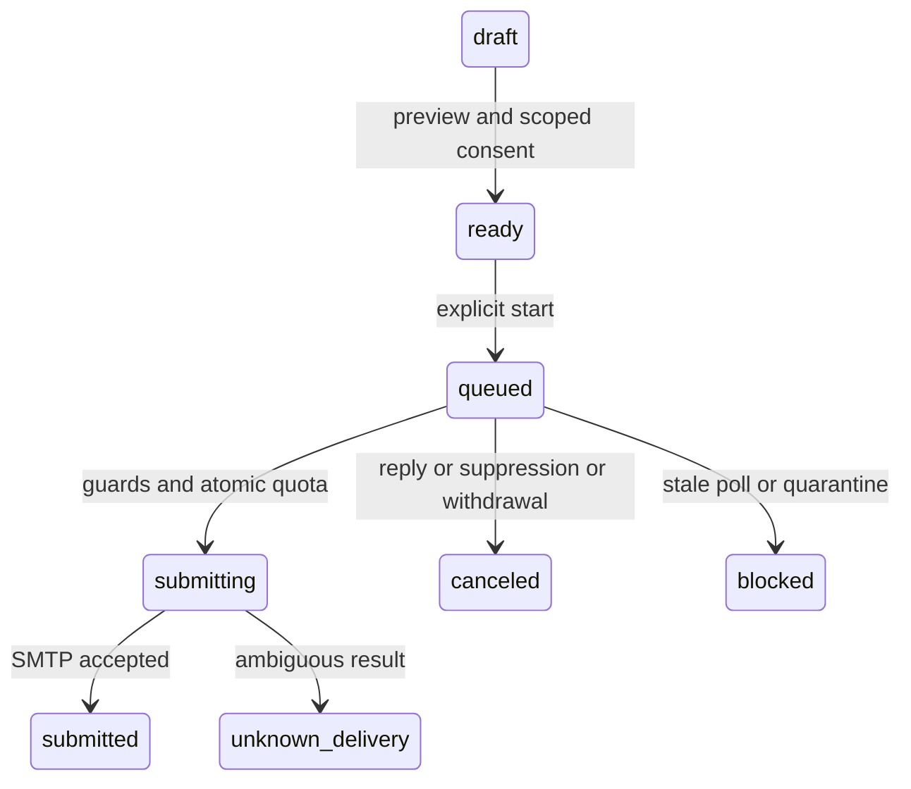

# Pseudocode — N7 v1

## Data Structures

Every entity has `id: UUID`, `created_at: Timestamp`. Tenant-owned records carry
`tenant_id`; authenticated tenant is obtained from server session only.
Account: email, password_hash, state. Session: token_hash, account_id, expires_at,
revoked_at. Mailbox: encrypted_credentials, key_version, provider_host, state,
daily_limit, last_imap_poll. Consent: mailbox_id, scope, scope_version,
actor_id, granted_at, revoked_at. PoolMembership: mailbox_id, state.
Campaign: tenant_id, content_version, state. Enrollment: recipient_hmac,
encrypted_address, personalization, state. Step: delay, subject, plain_body.
Job: unique(campaign,enrollment,step) or warmup pair key, state, message_id,
lease, transport_started_at. Quota: unique(mailbox,UTC_date), reserved, submitted.
Suppression: unique(tenant,recipient_hmac), reason. ReplyEvent: unique(mailbox,
UIDVALIDITY,UID). Observation: source, metric, unit, window, value, denominator,
observed_at, verified_by. Partner: code, account_id, state. PaymentIntent:
unique(tenant,idempotency_key), amount_minor, currency, plan_version, provider_id,
attribution_snapshot, status. Event: unique(source,event_key).

## Core Algorithms

### Algorithm: Identity and credential boundaries

REQUIREMENT: `FR-n7-001`
REQUIREMENT: `FR-n7-002`
REQUIREMENT: `NFR-n7-001`
REALISES: SC-US-001-1, SC-US-001-2, SC-US-002-1, SC-US-002-2
INPUT: cookie, request, configured runtime keys. OUTPUT: authorised result/error.
1. Validate bounded request and Origin for cookie-auth mutations; apply rate limit.
2. Authenticate hashed random session; reject expired/revoked/inactive with 401.
3. All queries use server tenant and requested id; absent/foreign row returns 404.
4. For credential save validate hostname against operator allowlist and resolved
   addresses. Reject loopback, private, link-local, metadata and IPv4-mapped forms.
   Pin approved resolution for connection and TLS servername; never disable TLS.
5. Encrypt secret with fresh nonce AES-GCM and AAD(tenant,mailbox,key_version).
   Persist ciphertext only. RETURN masked settings. No provider request on save.
COMPLEXITY: O(1) application plus bounded KDF/DNS.

### Algorithm: Consent and cohort scheduling

REQUIREMENT: `FR-n7-003`
REQUIREMENT: `FR-n7-004`
REALISES: SC-US-003-1, SC-US-003-2, SC-US-004-1, SC-US-004-2
INPUT: explicit user scope/version action or scheduler tick. OUTPUT: consent/job.
1. Require authenticated owner and distinct affirmative UI action per scope.
2. In transaction lock mailbox; grant/revoke exact version; revocation cancels
   pending jobs and pool membership. Campaign modifications invalidate consent.
3. Query eligible active verified mailboxes with current consent, fresh polling,
   no quarantine. Public dashboard exposes aggregate count, never peer identities.
4. IF fewer than two eligible tenants THEN RETURN waiting.
5. Choose distinct tenant pair, daily capacity and deterministic test template;
   create idempotent exchange job. Each direction requires own sender consent
   and recipient pool consent. Template reply limit prevents infinite recursion.
6. Jobs enter same dispatcher as campaigns; pool scheduler never calls SMTP.
COMPLEXITY: O(n) bounded eligible pool scan; indexed paging in production.

### Algorithm: Preview, reserve and dispatch

REQUIREMENT: `FR-n7-005`
REALISES: SC-US-005-1, SC-US-005-2, SC-US-005-3
INPUT: campaign version/job id. OUTPUT: sent, blocked, deferred, failed or unknown.
1. Validate <=5 steps, <=100 recipients, delays >=24h, known personalization keys;
   reject missing data, CR/LF in address/subject, unsafe source markup. Escape UI
   preview; outgoing message is plain text. No JS/eval templates or attachments.
2. Claim due job with SKIP LOCKED; lock mailbox and quota row. Recheck tenant,
   active consent/version, enrollment active, suppression absent, fresh IMAP,
   recipient pool membership if warmup, policy/provider limit and live gate.
3. Atomically reserve <=remaining quota; unique job key rejects duplicate claim.
   Per-mailbox single active transport lease serializes rotations. Commit before
   network I/O. Recheck cancellation immediately at the submission boundary.
4. Mark submitting durably before calling adapter; cancellation after this point
   cannot promise recall. Render signed unsubscribe URL/body/headers server-side.
5. Test mode calls isolated local sink. Live mode requires operator allowlist plus
   all guards; credentials decrypt only within adapter, then drop references.
6. SMTP accepted → submitted (not delivered). Definite pre-submission failure →
   bounded retry/backoff; ambiguous timeout/crash after submitting → unknown_delivery,
   retain consumed quota and require reconciliation, never blind resend.
7. Rotate next eligible mailbox by available quota, with same checks each attempt.
COMPLEXITY: O(log jobs) indexed claim, bounded content size.

### Algorithm: Ingest replies and stop pending steps

REQUIREMENT: `FR-n7-006`
REALISES: SC-US-006-1, SC-US-006-2
INPUT: bounded IMAP page. OUTPUT: events and advanced cursor.
1. Require TLS/provider allowlist. Poll bounded message headers with stable
   UIDVALIDITY/UID; match sender plus References/In-Reply-To to stored Message-ID.
2. In transaction deduplicate event, lock enrollment, set replied and cancel
   pending jobs. No subject-only matching; unrelated replies don't stop other tenant.
3. Advance cursor only in same transaction after accepted page. UIDVALIDITY change
   pauses mailbox until bounded safe rescan, preserving existing idempotency records.
4. Update successful poll timestamp; failed/stale ingestion pauses campaign dispatch.
COMPLEXITY: O(batch × indexed message-id lookup), batch max 100.

### Algorithm: Opt-out and complaint

REQUIREMENT: `FR-n7-007`
REALISES: SC-US-007-1, SC-US-007-2, SC-US-007-3
INPUT: signed unsubscribe token or authenticated complaint. OUTPUT: generic success.
1. Renderer appends body link and HTTPS List-Unsubscribe, List-Unsubscribe-Post.
2. GET validates token and displays confirmation without mutation. POST validates
   purpose-bound token (or RFC one-click form); no session/PII disclosure required.
3. Transaction UPSERT suppression; mark recipient enrollments suppressed and cancel
   pending jobs. Repeated requests produce same result. New jobs consult suppression.
4. Complaint ingestion requires operator auth or verified provider-specific proof;
   dedup event; same suppression plus sender quarantine; cancel pending work.
5. Never accept client-selected arbitrary tenant/address through token payload.
COMPLEXITY: O(k) affected enrollments, indexed suppression.

### Algorithm: Evidence-backed value and share

REQUIREMENT: `FR-n7-008`
REQUIREMENT: `FR-GROWTH-001`
REALISES: SC-US-008-1, SC-US-008-2, SC-US-010-1, SC-US-010-2, SC-US-010-3
INPUT: tenant observations/share action. OUTPUT: unknown or evidence report.
1. Owner submits source URL/reference, observed dates, metric/unit/window,
   raw value/denominator and explicit manual verification. Reject absent metadata.
2. Compare only same metric/source/unit and comparable windows; don't infer causality.
   Missing/stale/incomparable observation → unknown and share improvement disabled.
3. For explicit authorised share, produce anonymous report with provenance,
   lower sample counts, no contact addresses. Count one idempotent share event.
4. Foreign observation is 404. No automatic post/email or invented numeric score.
COMPLEXITY: O(n) bounded observation history.

### Algorithm: Attribution, entitlements and payment

REQUIREMENT: `FR-n7-009`
REQUIREMENT: `FR-GROWTH-002`
REQUIREMENT: `FR-GROWTH-003`
REQUIREMENT: `FR-GROWTH-004`
REALISES: SC-US-009-1, SC-US-009-2, SC-US-011-1, SC-US-011-2, SC-US-011-3, SC-US-012-1, SC-US-012-2, SC-US-012-3, SC-US-013-1, SC-US-013-2, SC-US-013-3
INPUT: explicit code/cookie, checkout request, verified provider event, report view.
OUTPUT: attribution snapshot, sandbox intent, entitlement or unavailable state.
1. Generate unique non-PII partner code; landing stores signed bounded cookie.
2. Before checkout resolve explicit code if supplied, otherwise valid cookie;
   invalid explicit code errors visibly. Reject inactive/self code.
3. Without sandbox provider config or server price RETURN unavailable. Never
   choose live provider by fallback. Unique client idempotency key creates immutable
   plan/amount/currency/attribution snapshot; API cannot override values.
4. Provider call outside DB transaction with same provider idempotency key.
   Verify provider canonical status+amount+currency+our metadata before grant.
   Duplicate/reordered event cannot duplicate or resurrect entitlement.
5. Report renderer queries current server entitlement; free/expired gets badge.
   User query paid=true has no authority. Unsubscribe always remains.
6. Partner aggregate counts dedup eligible events; mask other accounts, no
   reward promise. Under 30 samples show counts only, no percentage.
COMPLEXITY: O(1) indexed intent/event checks.

### Algorithm: Accessible operation and health

REQUIREMENT: `NFR-n7-002`
REQUIREMENT: `FR-LOOK-001`
INPUT: UI state or health request. OUTPUT: labelled UI/limited health response.
1. Render explicit loading/unknown/blocked/error states with next action.
2. Apply responsive layout, focus restoration, reduced motion and server errors.
3. Health returns service status/version only; performance test reports actual
   sample distribution separately from the target.
COMPLEXITY: O(rendered rows), bounded paging.

## API Contracts

Cookie auth, CSRF Origin validation for mutations; no arbitrary bearer fallback.
`POST /api/auth/register|login|logout`; `GET/POST /api/mailboxes`;
`POST /api/mailboxes/:id/consents`; `GET /api/pool`; `POST /api/campaigns`;
`POST /api/campaigns/:id/preview|start|pause`; `POST /api/observations`;
`GET/POST /unsubscribe/:token`; `POST /api/complaints` (operator);
`POST /api/share`; `GET /reports/:token`; `GET /r/:code`;
`POST /api/checkout`; `POST /api/payment-events` (verified adapter).
Success `{data,meta}`; errors `{error:{code,message}}`, 400 validation, 401 auth,
404 missing/foreign, 409 state, 429 bounded capacity, 503 unavailable integration.
No raw secret/body/provider error reflection. Public routes have separate rate limits.

## State Transitions

## Scenario Coverage

Scenarios in Specification.md: 32 · claimed by an algorithm: 32.

Not claimed by any algorithm:
none

Claimed by an algorithm but absent from Specification.md:
none

## Error Handling Strategy

Validation/state errors are explicit; auth errors reveal no account existence.
Integration unavailable is not success. Retry only proven pre-submit transient
errors with bounded count; unknown transport outcome never silently retried.

FR-LOOK-002 отклонено в Specification.md; алгоритм AI entry не создаётся.
