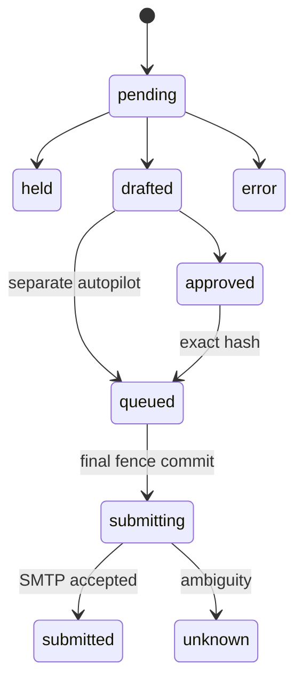

# Pseudocode — expanded-mvp delta v1

## Data Structures
Existing canonical entities retained; additive logical fields below. Each added entity has id: UUID, created_at: Timestamp.
- CapacityLease: tenant_id, mailbox_id, state enum(active,waiting_capacity), expires_at.
- WorkDue: tenant_id, mailbox_id, purpose enum(poll,pool,dispatch,ai), due_at, last_served_at, lease_until, owner_id.
- IncomingAIEvent: tenant_id, mailbox_id, semantic_event_id, arrival_at nullable, arrival_source, observed_at, eligible_at_arrival, policy_version, intent, state enum(pending,held,drafted,approved,queued,submitted,error,unknown), body_ciphertext nullable, body_bytes, thread_message_count, expires_at, terminal_at nullable.
- AIPolicy: tenant_id, mailbox_id, version, recipients/thread/intent allowlists, context_version, mode enum(hitl,autopilot), content_consent_at, expires_at, revoked_at nullable, token_cap, money_cap.
- AIDraft: tenant_id, event_id, version, content_hash, text_ciphertext, approved_hash nullable, approved_at nullable, model_id, token_reservation, budget_outcome, draft_at, expires_at.
- AIReplyJob extends existing dispatch: purpose=ai_reply, event_id, draft_version, draft_hash, policy_version; inherited state/quota/lease/Message-ID/outcome semantics unchanged.
- TimingOutcome: tenant_id,event_id, arrival_at/source nullable, observed_at,draft_at/approved_at/smtp_accepted_at nullable, reason, outcome, deadline, policy_version.

## Core Algorithms

### Algorithm: Unlimited connected и active admission
REQUIREMENT: `FR-expanded-mvp-001`
REQUIREMENT: `AC-expanded-mvp-001`
REALISES: SC-US-101-1
INPUT: tenant-bound event/config и current state.
OUTPUT: durable typed result.
STEPS:
1. Authenticate tenant and validate bounded create request; encrypt with existing tenant/mailbox AAD; do not consult commercial connected cap.
2. IF activation requested acquire admission row lock and count active leases; IF full persist waiting_capacity ELSE activate with lease. RETURN masked record; no send on save.
COMPLEXITY: O(n) по ограниченной странице/контексту; точечные transitions O(1).

### Algorithm: Live connection capability
REQUIREMENT: `FR-expanded-mvp-002`
REQUIREMENT: `AC-expanded-mvp-002`
REALISES: SC-US-102-1
INPUT: tenant-bound event/config и current state.
OUTPUT: durable typed result.
STEPS:
1. Load own ciphertext; validate AEAD and current operator allowlist. Resolve DNS, reject prohibited IPs, pin approved IP through connection and redirects/reconnects; retain TLS hostname/SNI verification, require TLS.
2. Independently perform SMTP AUTH/check without DATA and IMAP read-only auth; bound timeout. IF any failure return scrubbed typed status for that protocol ELSE store live capability with checked endpoint/config version; RETURN statuses.
COMPLEXITY: O(n) по ограниченной странице/контексту; точечные transitions O(1).

### Algorithm: Safe SMTP и bounded IMAP
REQUIREMENT: `FR-expanded-mvp-003`
REQUIREMENT: `AC-expanded-mvp-003`
REALISES: SC-US-103-1
INPUT: tenant-bound event/config и current state.
OUTPUT: durable typed result.
STEPS:
1. Read bounded UID headers with existing high-water/cursor/semantic-effect transactions; IF reset pause until complete scan+tail. Replays remain idempotent.
2. Dispatch uses existing final submitting transaction under global(7,1), then pinned transport outside lock. IF explicit pre-DATA transient use canonical retry bounds ELSE IF acceptance proven mark submitted ELSE mark unknown_delivery, retain reservation and never auto-retry. RETURN durable outcome.
COMPLEXITY: O(n) по ограниченной странице/контексту; точечные transitions O(1).

### Algorithm: Persistent fair warmup runtime
REQUIREMENT: `FR-expanded-mvp-004`
REQUIREMENT: `AC-expanded-mvp-004`
REALISES: SC-US-104-1
INPUT: tenant-bound event/config и current state.
OUTPUT: durable typed result.
STEPS:
1. Persist worker due state, leases and tenant rotation; claim oldest due tenant then mailbox with bounded SKIP LOCKED and per-provider concurrency. Poll deadlines independent of dispatch/pool loops.
2. IF pair/day conflict skip pair and continue bounded eligible cursor, not return to first pair. Schedule only both opted-in peers with fresh polls and budget; single reply requires submitted parent. IF no peer RETURN waiting.
3. Each cycle reclaims only safe expired non-submitting work, records queue age, yields/backoffs with jitter; shutdown stops new claims and preserves leases. RETURN progress checkpoint.
COMPLEXITY: O(n) по ограниченной странице/контексту; точечные transitions O(1).

### Algorithm: Inbound context и retention
REQUIREMENT: `FR-expanded-mvp-005`
REQUIREMENT: `AC-expanded-mvp-005`
REALISES: SC-US-105-1
INPUT: tenant-bound event/config и current state.
OUTPUT: durable typed result.
STEPS:
1. Authenticate physical/semantic event and commit inherited stop before new AI work. IF unsupported origin, optout, bounce, Auto-Submitted, loop marker, wrong tenant/reference or low confidence persist hold; never resume campaign.
2. Fetch own bounded plain text with byte caps BEFORE buffering; no attachments or URLs; truncate/hold explicitly, not hidden loss. Only supported intent + allowlisted context proceed.
3. Persist encrypted minimal content and expires_at=min(terminal+24h,created+7days); cleanup deletes content and drafts, retaining metadata≤30days. RETURN own-context reference.
COMPLEXITY: O(n) по ограниченной странице/контексту; точечные transitions O(1).

### Algorithm: OpenAI draft и HITL
REQUIREMENT: `FR-expanded-mvp-006`
REQUIREMENT: `AC-expanded-mvp-006`
REALISES: SC-US-106-1
INPUT: tenant-bound event/config и current state.
OUTPUT: durable typed result.
STEPS:
1. Check explicit OpenAI content consent, provider gate, model allowlist and reserve token/money budget transactionally; dedup event+policy_version. IF missing RETURN blocked.
2. Build system instructions independent of untrusted quoted email; no credentials, tools, remote fetch or cross-tenant context. Request structured bounded draft+intent with timeout; unknown billing outcome retains budget and does not blind retry.
3. Validate output/intent/grounding against allowed context, strip header controls, enforce sizes; IF invalid/uncertain RETURN hold ELSE save version+hash. Approval binds hash/version; edit invalidates approval. RETURN draft; model cannot enqueue/send itself.
COMPLEXITY: O(n) по ограниченной странице/контексту; точечные transitions O(1).

### Algorithm: Отдельное разрешение AI reply
REQUIREMENT: `FR-expanded-mvp-007`
REQUIREMENT: `AC-expanded-mvp-007`
REALISES: SC-US-107-1
INPUT: tenant-bound event/config и current state.
OUTPUT: durable typed result.
STEPS:
1. Inbound remains replied/stopped. Check manual approval exact hash OR distinct current autopilot policy with scope/expiry/revocation/budgets. Create unique(event,reply-purpose) job transactionally; never create reply-to-own-auto-reply loops.
2. Under global(7,1) first, recheck policy/hash/current suppression/quarantine/consent/freshness/shared UTC quota and lease; ai_reply requires its own authority while campaign steps remain canceled. IF any guard false RETURN hold/cancel and0 socket calls.
3. Commit submitting irreversible boundary, then call safe transport; stop after commit affects future work only. RETURN durable accepted/unknown result.
COMPLEXITY: O(n) по ограниченной странице/контексту; точечные transitions O(1).

### Algorithm: Честный full-path SLO
REQUIREMENT: `FR-expanded-mvp-008`
REQUIREMENT: `AC-expanded-mvp-008`
REALISES: SC-US-108-1
INPUT: tenant-bound event/config и current state.
OUTPUT: durable typed result.
STEPS:
1. On arrival fix event policy/cohort and trusted arrival provenance; do not derive arrival from Date/observed. Record timestamps at durable transitions.
2. At frozen window close/deadline classify every event including eligible+unsafe+HITL; missing/error/overdue latency infinity, timestamp unknown separate. Quantile uses entire eligible population, publish completed-only diagnostic separately.
3. IF unknown arrival prevents proof do not claim unconditional arrival SLO; publish counts and failed/unverifiable state. RETURN p95/p99, ontime/N and every outcome bucket with resource/load evidence.
COMPLEXITY: O(n) по ограниченной странице/контексту; точечные transitions O(1).

### Algorithm: Безопасность и эксплуатационные ворота
REQUIREMENT: `NFR-expanded-mvp-001`
REQUIREMENT: `AC-expanded-mvp-009`
REALISES: SC-US-109-1
INPUT: tenant-bound event/config и current state.
OUTPUT: durable typed result.
STEPS:
1. On startup and every external action check operator capability scoped to account/provider/purpose/expiry and content/budget consent. Missing live evidence cannot inherit local verification.
2. Kill switch writer obtains global(7,1) before all eligibility writes; revoke/cancel before final boundary sends0. Reserve shared rate budget; exhausted cap blocks with due time.
3. Log opaque IDs/reasons only, scrub secrets, keep TEST payment paths separate. RETURN readiness_local and readiness_live independently.
COMPLEXITY: O(n) по ограниченной странице/контексту; точечные transitions O(1).

## API Contracts
Используется существующая session cookie+Origin authorization, не новый Bearer auth.
- POST /api/mailboxes и POST /api/mailboxes/:id/verify: existing shape + explicit mode;200 masked data/meta;400 invalid,403 scope,409 active_capacity,503 unavailable.
- PUT /api/mailboxes/:id/ai-policy: own scoped version/mode/limits/content consent;200 data/meta;403 foreign/consent,409 stale version.
- GET /api/ai-drafts?cursor=...: tenant-only bounded page;200 data/meta,401 session.
- POST /api/ai-drafts/:id/approve: version+hash;200 approval;409 stale,410 expired.
- GET /api/ai-metrics?window=...: bounded tenant report200,400 invalid range. All errors typed code/message without body/credentials; foreign record404.

## State Transitions

Existing job statuses remain canonical; event state queued also covers submitting, transport attempts hold precise boundary state. Draft edit creates new version requiring new approval. unknown never automatically returns to queued.

## Error Handling Strategy
Transport proven pre-DATA: inherited bounded retry. Ambiguity: unknown hold. IMAP reset: pause/rescan. LLM unavailable/budget/unsafe: hold/error visible. Capacity: waiting_capacity. Revocation/suppression: cancel before final commit. No error bypass for latency target.

## Scenario Coverage
Scenarios in 01_specification.md: 9 · claimed by an algorithm: 9

Not claimed by any algorithm:
none

Claimed by an algorithm but absent from Specification.md:
none

## Normative AI correction N7-VAL-001

Algorithms OpenAI draft и HITL / Отдельное разрешение AI reply MUST implement [ai-policy-v1](ai-policy-v1.md): deterministic server intent+topic mapping and current own snapshot admission before generation; model only selects allowed exact snippet IDs; verify exact required set and deterministically assemble approved bytes. Arbitrary model text cannot autosend. Intent/language ambiguity, missing/foreign facts, unsupported authority yield hold. Event admission immutable for denominator; subsequent generation/error/quality hold remain eligible. Nearest-rank p95 sorts all eligible effective latencies, takes ceil(0.95*N),1-based; errors/unknown/overdue infinity, N0 unverifiable. Active capacity admission locks a GLOBAL installation capacity row30, not one30-row allowance per tenant.
