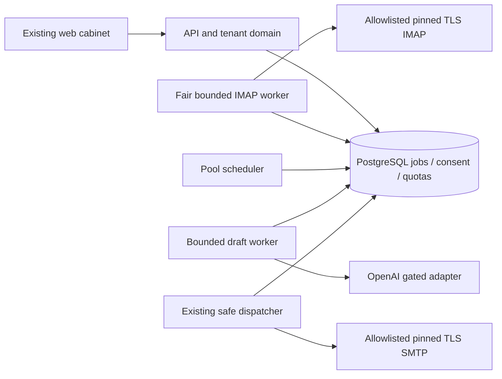

# Architecture — expanded-mvp delta v1

## Architecture Overview
Distributed Monolith: existing Node22/TypeScript native HTTP + PostgreSQL16, separate persistent worker processes. No new framework/queue service.

## Component Breakdown
f07 owns commercial connected policy and finite active admission; f08–09 thin live verifier/SMTP/IMAP adapt capabilities without copying donors. f10 persistent loops use shared PG due state/leases. f11 owns body minimization and stop-first event classification; f12 own OpenAI draft boundary and approval UI; f13 integrates distinct purpose into existing fence; f14 reports outcomes from durable records. Existing auth/billing/crypto continue to be authorities.

## Technology Stack
| Layer | Technology | Rationale |
|---|---|---|
| Frontend | Existing server shell+TS | preserve CJM/accessibility |
| Backend | Node22/TS/native HTTP | no framework migration |
| Database | PostgreSQL16 | durable state and atomic quota |
| Cache | none | no second consent authority |
| Queue | existing PG + SKIP LOCKED | idempotent claims and recovery |
| Infrastructure | existing isolated Docker Compose | no shared proxy change |
| Browser | Docker Playwright1.63.0 | owner requirement |
| Transport | thin Nodemailer/ImapFlow adapters, versions pinned after contract check | protocol support behind N7 guards |
| AI | thin OpenAI API boundary, model operator configured | no SMTP/tools exposed to model |

## External Dependencies
| Capability needed | Provider / API | Evidence | Verdict | Requirements relying on it |
|---|---|---|---|---|
| SMTP required TLS | Nodemailer | canonical Architecture checked2026-10-02 quotes SMTP docs “Nodemailer requires a STARTTLS upgrade”; recheck exact pinning/abort/version contract before dependency selection | CONFIRMED | FR-expanded-mvp-002, FR-expanded-mvp-003 TLS capability only |
| IMAP connect/read | ImapFlow | canonical Architecture checked2026-10-02 Quick Start quote “await client.connect()”; bounded fetch/cancel exact contract still to verify | CONFIRMED | FR-expanded-mvp-002 connect capability only |
| Pinned socket/TLS, bounded cancellation, precise DATA outcomes | selected libraries + real provider | no fresh capability evidence in this PLAN | UNCONFIRMED | dependent live parts FR-expanded-mvp-002/003 |
| Own live account access/send, complaint route, trustworthy arrival timestamp | operator-selected SMTP/IMAP provider | account/provider not selected in supplied context | UNCONFIRMED | live parts FR-expanded-mvp-002/003/004/008 |
| Bounded generation/structured response, model/token contract/data handling | OpenAI API | primary API capability pages not opened in this source-only unit; must be verified before implementing dependent adapter | UNCONFIRMED | live OpenAI portion FR-expanded-mvp-006 |

CONFIRMED rows inherit source-bound canonical evidence, not fresh web validation. UNCONFIRMED blocks only dependent Phase3 capability until primary documentation, opened date and short quote establish it; unrelated local queue/context/fixtures work proceeds. No fabricated source quotes. Before live pilot verify account terms/permissions plus timestamp meaning; IMAP INTERNALDATE may not prove arrival. OpenAI data handling must match local retention disclosure; local TTL alone does not prove provider TTL.

## Data Architecture
Logical model and field enums are owned by 02_pseudocode.md. Additive PG migrations map each entity to tenant-bound rows with FK ownership constraints. Unique event/policy draft generation and event/purpose dispatch keys; index due state by tenant/due_at, expiry for cleanup, and mailbox/current active lease. Locks around capacity and quota reservations; all eligibility-changing AI policy/approval writers acquire global(7,1) FIRST. Stop-effect commits before AI tasks; ai_reply references stopped enrollment without reactivating it. No body in general audit. Ciphertexts use versioned tenant/mailbox AAD and external runtime keys.

## Security Architecture
Current cookie/Origin/tenant authentication and server AEAD remain. Endpoint approval binds IP+hostname+ports+TLS to exact config version; reconnect revalidates and pins. All outbound recipients derive server-side from own correlated thread, never model output. Prompt email content is untrusted quoted data; no tool access, credentials or arbitrary URLs; allowlisted context, output schema and unsupported-intent hold. Separate OpenAI processing consent and AI autopilot scope; model never authorizes sending. Quotas include every ai_reply reservation. Global lock not held over network I/O and never replaced casually. Kill switch/off gate is checked at final commit; accepted in-flight boundary visibly disclosed.

## Scalability Considerations
Commercial connected records are paginated and not always-active sockets. Finite admission30 active; scheduler fair tenant rotation with oldest due selection and dedicated poll capacity. Rescan cannot starve healthy polling; per-provider cooldown and reserved poll slots. Bound batches/parse memory; load tests measure poll freshness, queue age, lock wait, worker RSS, rate caps. Saturation produces visible waiting/hold and SLO misses. Scale-up outside measured A1 requires another capacity test, no unlimited-throughput assertion.

## Reconciliation with Pseudocode
Расхождений с `02_pseudocode.md` не найдено. Сверены сущности: CapacityLease, WorkDue, IncomingAIEvent, AIPolicy, AIDraft, AIReplyJob, TimingOutcome; алгоритмы: Unlimited connected и active admission, Live connection capability, Safe SMTP и bounded IMAP, Persistent fair warmup runtime, Inbound context и retention, OpenAI draft и HITL, Отдельное разрешение AI reply, Честный full-path SLO, Безопасность и эксплуатационные ворота. Physical tables derive fields from logical role; event queued covers transport submitting without adding a contradictory event enum.

## N7-VAL-001 placement

[ai-policy-v1](ai-policy-v1.md) uses existing src/ai policy/validator/assembly boundaries and versioned JSON fixtures; no new service. Immutable own-tenant snapshot stores approved fields/snippets, language/intent/topic mapping and version/hash. API approval binds exact output; server assembly checks current hashes at final fence. Global installation capacity row caps all tenant leases combined at30. New logical snapshot/mapping data is normative in ai-policy-v1, no independent conflicting schema.
