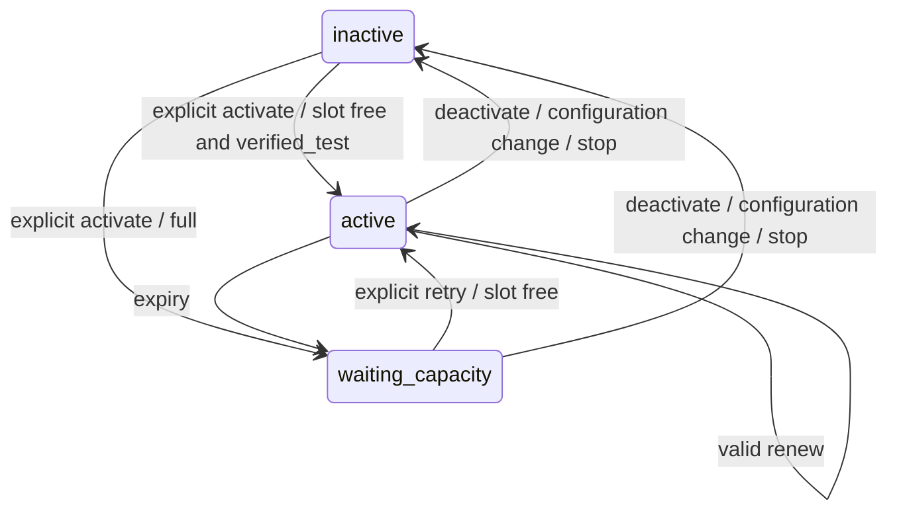

# F07 — Algorithms

Source revision: c80504ac. Все REQUIREMENT claims относятся к 01_specification.md.

## Data Structures

Mailbox: existing id UUID, tenant_id, created_at Timestamp, state/AEAD unchanged.
InstallationCapacity: id integer singleton1, active_limit integer CHECK=30.
CapacityLease: id UUID, tenant_id UUID, mailbox_id UUID unique, created_at Timestamp,
state enum(active,waiting_capacity), expires_at Timestamp nullable; active requires
nonnull expiry, waiting requires null. Composite FK tenant_id,mailbox_id→mailbox.
No lease = activation not requested. API projection expired active→waiting_capacity.
MailboxPage: items masked Mailbox[], total own integer, limit, nextCursor UUID|null.
Mailbox adds capacity:{state:'inactive'|'active'|'waiting_capacity',expiresAt:null|ISO}.

## Core Algorithms

### Algorithm: Save unlimited connected
REQUIREMENT: `AC-f07-connected-capacity-001`
REALISES: SC-US-201-1
INPUT: authenticated tenant, bounded mailbox input. OUTPUT: masked mailbox.
1. Charge existing limiter before parsing body. For PUT check ownership before DNS.
2. Validate existing parseMailbox/allowlist/pinning input; DNS outside transaction;
   encrypt using current tenant/mailbox AAD. Never call send or grant consent.
3. BEGIN through eligibilityTransaction: lock(7,1) FIRST. IF PUT recheck ownership,
   cancelMailbox (including capacity release), set configured; ELSE insert configured
   without commercial checkCapacity(mailboxes). COMMIT; RETURN masked record.
COMPLEXITY: O(1) indexed own mutation, existing cancellation cost unchanged.

### Algorithm: Reserve renew release global capacity
REQUIREMENT: `AC-f07-connected-capacity-002`
REQUIREMENT: `AC-f07-connected-capacity-003`
REALISES: SC-US-201-2, SC-US-201-3
INPUT: tenant/mailbox/action activate|renew|deactivate. OUTPUT: capacity projection.
1. BEGIN eligibilityTransaction lock(7,1) FIRST, then singleton row FOR UPDATE,
   then own mailbox row FOR UPDATE. IF foreign RETURN404 via rollback.
2. Capture clock_timestamp AFTER locks. IF deactivate delete own lease; move own
   claimed jobs back to queued, clear reserved_day/lease_owner/lease_until;
   never touch submitting/submitted/unknown; COMMIT RETURN inactive.
3. Require verified_test and credential envelope. IF not RETURN409 mailbox_changed.
4. Demote expired active leases to waiting_capacity/expires_at NULL; at most30
   active rows under invariant. IF renew and own lease absent/waiting/expired,
   RETURN409 capacity_lease_expired; explicit activate is required for reacquisition.
5. IF own unexpired active extend expires_at=now+120s. ELSE IF count active<30,
   upsert active expires_at=now+120s; ELSE upsert waiting_capacity, expiry NULL.
   COMMIT; RETURN current projection. Saturation is200 persisted waiting, not rollback409.
6. Extend shared cancelMailbox(client, mailbox) to delete the capacity lease via
   release helper inside the caller's existing eligibility transaction. Every
   PUT/pause/quarantine cancellation uses that path, including
   suppression → complaintClient → cancelMailbox → quarantined. Release and
   quarantine commit atomically; rollback preserves both prior states. No nested
   transaction or lock before global(7,1); preserve existing consent revocation,
   pool membership removal and queued/claimed job cancellation. The next activation can reuse
   the slot immediately after commit; never wait for120s expiry. A revoke of one
   consent scope is not mailbox quarantine and need not release its lease.
COMPLEXITY: active scan≤30; O(log connected) own index lookup.

### Algorithm: Require capacity throughout real dispatch
REQUIREMENT: `AC-f07-connected-capacity-004`
REQUIREMENT: `AC-f07-connected-capacity-005`
REALISES: SC-US-201-4, SC-US-201-5
INPUT: pool tick, queued or claimed job. OUTPUT: eligible job or hold/no transport.
1. Extend shared freshMailbox predicate with EXISTS lease bound tenant_id AND
   mailbox_id, state=active AND expires_at>current post-lock time. Retain
   verified_test/credentials/fresh complete poll, NOT replace these checks.
2. poolEligible inherits capacity; pool aggregation/tick and both pool endpoints
   therefore use same guard. Campaign enqueue may remain queued while waiting;
   no admission is acquired by enqueue, claim or final submit.
3. claim samples time after lock; use that same time for lease/freshness/due and
   quota UTC day. In final SubmissionStore reuse post-lock now and ALL existing
   scope/version/suppression/limits/claimed-owner/retry conditions. IF any guard
   false RETURN null with0 adapter calls, no submitting transition.
4. If final transition commits first, retain existing in-flight limitation and
   unknown hold. Release cannot erase submitted/unknown quota or retry it.
5. Run adapter only after COMMIT. Stop/renew/expiry may never bypass final guard.
COMPLEXITY: indexed lease lookup per candidate; current bounded dispatch unchanged.

### Algorithm: Page own connected records
REQUIREMENT: `AC-f07-connected-capacity-006`
REALISES: SC-US-201-6
INPUT: tenant, limit/after UUID. OUTPUT: MailboxPage.
1. Authenticate; validate limit25/max100 and optional UUID cursor. Resolve cursor
   WHERE tenant_id=$tenant AND id=$after; foreign/missing404, never foreign anchor.
2. SELECT masked rows WHERE tenant_id=$tenant AND (created_at,id)>(anchor time,id)
   when cursor provided, ORDER BY created_at,id LIMIT limit+1; return at most limit,
   nextCursor last returned id iff extra row. Separate own COUNT for total.
   No credentials selected; no maximum page index or total connected cap.
3. Project expired capacity as waiting without renewal/mutation. RETURN page.
4. Mutation auth/origin checks precede side effects; use existing charge before
   body parsing for create/capacity; any foreign mailbox returns404.
COMPLEXITY: O(log connected+limit) indexed keyset scan, limit≤101; COUNT remains
O(own connected) without materializing mailbox data.

### Algorithm: Render page and explicit capacity controls
REQUIREMENT: `AC-f07-connected-capacity-007`
REALISES: SC-US-201-7
INPUT: own MailboxPage and detail/capacity. OUTPUT: cabinet view.
1. Load one page; display total, page controls, masked state and capacity separately.
2. On explicit activate/renew/deactivate POST then refresh own detail/page; show
   waiting and expiry honestly. No periodic renewal or implicit consent/send.
3. Campaign chooser offers page navigation, keeping selected mailbox identity;
   overview uses total. Preserve SessionClient epoch checks on every async path.
4. Render unlimited connected for both plans; show active global30 separately;
   unchecked consent, accessible labels, busy/error feedback remain.
COMPLEXITY: O(page size) browser memory, no eager all-page fetch.

### Algorithm: Additive migration and billing compatibility
REQUIREMENT: `AC-f07-connected-capacity-008`
REALISES: SC-US-201-8
INPUT: schema11, existing data and TEST billing requests. OUTPUT: schema12 + same entitlements.
1. Add singleton capacity and lease tables/indexes in migration12. Existing
   mailbox states/records unchanged, no auto lease backfill. Register filename and version12 readiness check in db.ts.
2. Set both PLANS.mailboxes=null; remove mailbox branch from checkCapacity API,
   retain activeCampaigns numeric3/10 and all TEST_TEAM/payment logic.
3. Update billing/web types explicitly number|null and render null as unlimited.
4. Deploy only with workers drained under separate authorization; migration then
   new binary then explicit activation. Rollback must not run old sender guard
   while traffic enabled. RETURN migration readiness, not product acceptance.
COMPLEXITY: indexed additive DDL; no unbounded data rewrite.

## API Contracts

Existing cookie session + Origin (not Bearer) and {data,meta} envelope retained.
- POST /api/mailboxes →201 existing masked Mailbox+capacity; existing payload.
- GET /api/mailboxes?limit=25&after=<own-last-uuid> →200 data:MailboxPage (update all consumers).
- GET /api/mailboxes/:id →200 own masked Mailbox+capacity.
- POST /api/mailboxes/:id/capacity {action:'activate'|'renew'|'deactivate'} →200
  own capacity, including waiting_capacity. Exact keys; malformed400; unauthorized401,
  origin403; foreign404; not verified409 mailbox_changed; stale renew409
  capacity_lease_expired; rate429; DB failure503. No operator capacity overwrite API.
- Existing POST /api/mailboxes/:id/verify-test remains diagnostic only.
- Existing PUT/PATCH and consents routes retain scopes and response semantics.

## State Transitions

## Error Handling Strategy

Invalid/foreign input does not allocate. DB failure rolls back atomically. Saturation
persists waiting200. Lease missing/expiry fail closed; freshness/quota/consent errors
retain existing no-send behavior. Never recover submitting/unknown through capacity.

## Scenario Coverage

Scenarios in 01_specification.md: 8 · claimed by an algorithm: 8.
Not claimed by any algorithm: none.
Claimed by an algorithm but absent from 01_specification.md: none.
