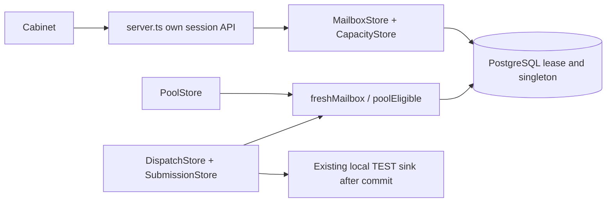

# F07 — Architecture delta

## Architecture Overview

Existing distributed monolith, PostgreSQL16/Node22/TypeScript; no new service.
Source inspected: c80504ac. Existing-source mode: no regenerated CLAUDE/research.

## Component Breakdown

| Files inside project | Bounded implementation |
|---|---|
| src/billing/plans.ts | null mailbox limits; activeCampaigns-only checkCapacity |
| src/mailboxes/store.ts | paginated list/read projection; remove cap; shared cancelMailbox releases lease for every PUT/pause/quarantine caller |
| src/mailboxes/capacity.ts (new) | transaction wrapper and client helper; active30/TTL120 constants |
| db/012-connected-capacity.sql; src/db.ts | additive schema12, migration list and ready() requiring12 |
| src/dispatch/eligibility.ts | tenant-bound unexpired lease predicate |
| src/dispatch/store.ts | obtain now after lock (keep injectable clock for tests) |
| src/dispatch/submission.ts; src/pool/store.ts | reuse strengthened predicate; verify post-lock time flow |
| src/server.ts | bounded page/capacity route; existing suppression.charge on creation/capacity |
| src/web/models.ts, mailboxes.ts, campaigns.ts, app.ts, billing.ts, client.ts | page types/controls, honest total, capacity controls/errors, unlimited label |
| tests/*-unit.test.ts, tests/*-integration.test.ts, existing browser scripts | new boundary tests + narrow fixture updates |

src/consent/store.ts remains source of authority; lease does not grant or revive
consent. Revoke may leave active slot reserved until explicit deactivate/expiry;
this is bounded120s and cannot allow sending. Do not infer release after one
scope revoke when another remains. Mailbox quarantine is different: every
quarantine/PUT/pause cancellation must release capacity atomically through shared
cancelMailbox in src/mailboxes/store.ts. The existing src/dispatch/seams.ts
complaintClient path (called by src/suppression/store.ts) already invokes that
helper before setting quarantined; extending the helper covers complaint release
without a second transaction. No suppression/reply caller that quarantines a
mailbox may keep its lease until expiry. State/consent/final guards remain intact.
F10 owns automatic fair admission/renewal, not this implementation slice.

## Schema and lock order

capacity_pool singleton id=1 CHECK, active_limit=30 CHECK; row seeded once.
capacity_lease has UUID id and unique mailbox_id; composite tenant/mailbox FK,
created_at, state enum and active/non-null expiry versus waiting/null CHECK.
Indexes: active state/expires_at and mailbox(tenant_id,created_at,id).
No plaintext credentials; no business data in singleton. Connected count has no
commercial ceiling. Do not rename verified_test to active: these are independent axes.

All eligibility mutations: BEGIN → pg_advisory_xact_lock(7,1) FIRST → optional
capacity singleton FOR UPDATE → mailbox/lease rows → post-lock clock → mutation
→ COMMIT. Never acquire a capacity lock before global advisory lock. Existing
stop transaction already owns global lock; client helper may take singleton later.
No IO under lock. Final fence consults same rows under same global serialization.
Migration executes under existing migration lock with workers drained; runtime
must never initialize leases opportunistically from verified_test rows.

## Technology Stack

| Layer | Technology | Rationale |
|---|---|---|
| Frontend | Existing TypeScript DOM cabinet | Same session lifecycle and accessibility |
| Backend | Native HTTP/pg | Reuse auth, error envelope, bounded body and limiter |
| Database | PostgreSQL16 | Atomic global admission, durable expiry |
| Cache | None | One capacity authority |
| Queue | Existing send_job | No competing send or retry system |
| Infrastructure | Existing N7 Docker | Node22 runtime; no new ports/dependencies |

## External Dependencies

F07 adds no third-party service call. Existing local TEST adapters are sufficient
for all F07 AC. Expanded provider/AI capability evidence remains in expanded-mvp
and ai-policy-v1; F07 neither confirms live readiness nor spends external budget.

## Model consistency

CapacityLease state active/waiting_capacity and expires_at map expanded pseudocode.
Inactive is API absence, not a third persisted lease state. Expired active rows are
logically waiting at read; next serialized mutation normalizes at most30 rows.
120s renewal is explicit and does not establish F10 24×7 cadence. Global pool30
is installation scoped, never tenant30. Safety-v1 and TEST financial boundaries hold.
