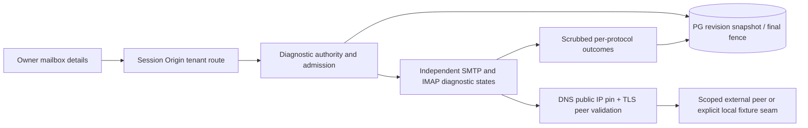

# F08 — placement and trust boundaries

Use existing native HTTP + pg + Node22 architecture. No framework/service/queue addition. The selected runtime API is Node22.20.0 already pinned by Dockerfile; host default Node20 is unsuitable for runtime acceptance. See capability-contracts.md for primary-source selection and rejected alternatives. This package changes no dependencies.

## Components and future implementation ownership

One Sol6.1 high writer≤20min/attempt implements within project paths; coordinator owns integration/manifest reconciliation. Fresh Astra high reviewer≤8min follows; requested models are not actual-model evidence. No nested work is needed for this slice.

- src/mailboxes/network.ts: reuse normalizeHost/isPublicIp/resolveEndpoint; add cancellable pinned raw/TLS connector with byte/phase guard. Do not weaken existing public-IP policy to accommodate tests.
- src/mailboxes/diagnostics.ts plus small protocol files if needed: finite SMTP/IMAP auth states and typed errors, no generic send API; every file<500 lines.
- src/mailboxes/store.ts and shared cancellation: diagnostic start/finish and common invalidation; preserve existing TestAdapter and verify-test semantics.
- db/013-live-diagnostics.sql: additive mailbox diagnostic_revision bigint default0, diagnostic_attempt UUID nullable, diagnostic_result JSONB constrained/validated in app. No mailbox state enum expansion, no success/lease backfill. One current snapshot suffices; no new event platform.
- src/config.ts: diagnostics disabled default; validated operator grant file has version, diagnostic-only scope, approved tenant/mailbox endpoint tuples, config revision and UTC expiry. Operator installs only after separately authorized external scope. Read and fingerprint current grant at begin/finish; unreadable/revoked/expired fails closed. Request cannot supply or extend grants. Diagnostic global process cap is not the global active-mailbox cap.
- src/server.ts: own POST diagnostics plus read projection, existing authentication/Origin/rate controls, explicit typed codes; no production route selects fixture mode. Use process-owned admission singleton.
- src/web/mailboxes.ts and models/client as needed: independent persistent statuses and mode, no automatic capacity/consent requests.
- tests/diagnostics-{unit,integration}.test.ts, tests/expanded-mvp-02.test.ts (parent witness; ensure explicit runner includes it), tests/fixtures/diagnostic-tls.ts and scripts/ui/f08-diagnostics.mjs: planned files, not existing acceptance evidence.

## Revisions and concurrency

Mailbox revision covers replacement even with identical ciphertext/settings, every stop/quarantine and new attempt. Stop hook must live in common cancelMailbox path used by suppression quarantine, not only HTTP PATCH. Provider config fingerprint includes normalized allowlist/ports/TLS policy plus operator grant revision and scope. Save-time DNS cannot stand in for connect-time DNS. Begin/finish share existing eligibilityTransaction; global lock(7,1) is the first DB lock, then own row, then current DB clock; no transaction crosses DNS/socket work. Failure at persistence rollback leaves no partially verified state. Existing submission/quota/capacity/consent are distinct and unchanged.

## Interfaces

DiagnosticOutcome: protocol smtp|imap; tls pending|ok|failed|not_attempted; auth pending|ok|failed|unsupported|not_attempted; result success|failed|cancelled; code from fixed enum; checkedAt; evidenceMode local_test|protocol_fixture|live_provider; revision/attempt/config fingerprint. Public mapping may omit internal fingerprint but must retain mode/time/current. Parent current live capability requires both successful current live_provider results and independently valid live authority; F08 never enables a sender.

Production connector accepts only validated PinnedEndpoint and signal, not arbitrary TLS overrides. Local fixture constructor is imported by tests only and injects a connector mapping a validated synthetic public endpoint to loopback plus a fixture CA while preserving hostname verification, TLS state machine, budgets and byte parser. Assert normal production rejects the same loopback address. DNS pin tests instrument actual dial arguments and no second resolver call; TLS fixture tests observe real transcripts. F09 may reuse connector and statuses; DATA outcomes, UID readers and arrival provenance require separate contracts before implementation.
