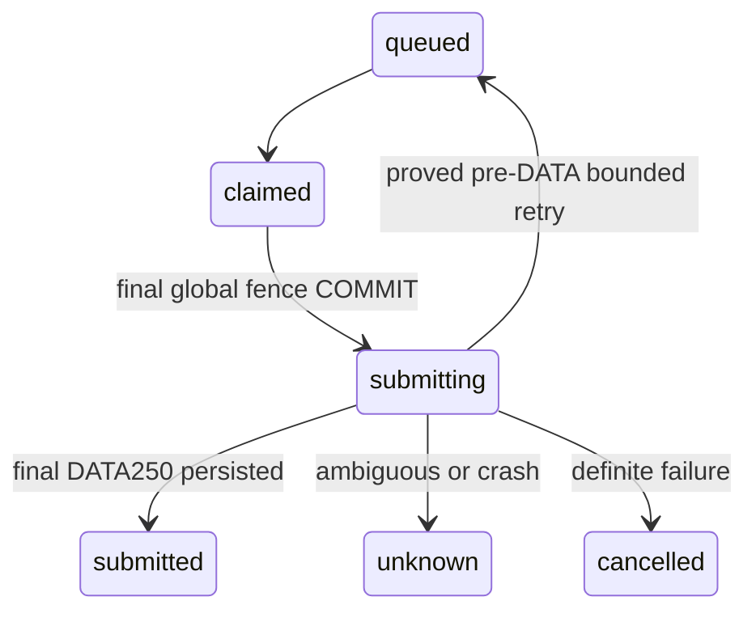

# F09 — logical contracts and algorithms

PLAN; baseline801b1102972f76e67f17ce7f7dada7cc79de5ec7. Algorithms are prospective, not runtime evidence.

## Data Structures

TransportGrant: tenant/mailbox UUID; revision bigint monotonic; state active|revoked; capabilities subset smtp_submit,imap_headers; endpoint tuples; mailboxTransportRevision bigint; configFingerprint SHA256; expiresAt timestamp. Missing row is denied. Publication requires expected prior revision (zero when absent).
Mailbox.transport_revision bigint default0 is separate from diagnostic_revision, incremented on credential/settings replacement and every stop/quarantine, including identical replacement/ABA. Diagnostic attempts do not grant or renew transport authority.
TransportSnapshot: grant revision, mailbox revision, tenant/mailbox, ciphertext, endpoints, process fingerprint, operation UUID, expiry. Credentials are decrypted transiently outside DB transaction.
TransportOperation: one of six fixed global slots (smtp1..2, imap1..4), tenant/mailbox, owner UUID, expiresAt; protocol/mailbox unique while occupied. Lease120s, no extension by stale owner; operation hard deadline≤90s. An abandoned lease expires; active process must destroy its socket before its own hard deadline. F10 reuses admission rather than creating a second concurrency counter.
SubmissionOutcome: accepted{acceptedAt,mode}|pre_data_transient{proof:no_data_submitted}|permanent{proof:no_data_submitted}|rejected_after_data|ambiguous. Receipt records job/attempt/messageId/mode/acceptedAt, no secret/body. Existing send_job states unchanged.
Snapshot/HeaderPage retain existing fields; Snapshot.provenance extends to imap_headers. Rescan identity remains runId,attempt,uidvalidity,expectedCursor; provenance remains local_fixture|imap_headers. Protocol fixture evidence mode is separately derived from explicit harness construction.

## Core Algorithms

### Algorithm: Publish and authorize transport
REQUIREMENT: `FR-f09-live-transport-001`
REQUIREMENT: `AC-f09-live-transport-001`
REALISES: SC-F09-001
INPUT: privileged process capability, bounded grant file or revoke, expected revision; runtime identity/config.
OUTPUT: committed revision or denial; immutable operation snapshot.
STEPS:
1. Require configured operatorTokenDigest and privileged process/file invocation; parse≤16KiB file outside TX, fixed scope/keys/UUID/endpoints/expiry. Invalid authorized publish revokes at expected revision and reports failure; DB failure is not successful revocation.
2. eligibilityTransaction takes global lock FIRST, then own mailbox/grant rows. Compare expected revision, current transport_revision and post-lock DB clock. Increment revision on every publish/revoke, including identical grant; missing grant is revoked. Grant endpoints and fingerprint must equal current process allowlist/policy and metadata.
3. Runtime mode disabled denies; local_test uses existing local paths; live_provider requires active matching capability, unexpired grant and permitted mailbox state before decrypt/DNS. For pool eligibility require both participants' current grant and IMAP capability, sender smtp_submit. Never derive authority from diagnostic success.
4. RETURN snapshot; publish does not alter readiness, capacity, consent or schedule. Revocation invalidates polls and cancels movable jobs under same global lock; submitting/unknown stay retained.
COMPLEXITY: O(1) own rows plus existing cancellation work.

### Algorithm: Commit final send eligibility
REQUIREMENT: `FR-f09-live-transport-002`
REQUIREMENT: `AC-f09-live-transport-002`
REALISES: SC-F09-002
INPUT: claimed job and owner, selected process mode, snapshot and rendered candidate.
OUTPUT: prepared durable attempt or blocked.
STEPS:
1. Prepare validated bounded wire/message identity outside final TX from an authorized snapshot; do not send or record accepted. Acquire durable operation slot before final transition; release on blocked/error.
2. Take eligibilityTransaction FIRST lock. Read DB time after row locks. Recheck job claim/owner/lease/due/attempt budget, sender revision/grant/expiry/endpoints/config and recipient grant for pool; recheck canonical sender+recipient freshMailbox, capacity and separate consent/suppression/campaign version predicates.
3. Recompute UTC reservation day and default10/ceiling30/provider quota over claimed/submitting/submitted/unknown; no separate transport quota. Preserve known pre-DATA retry rule. Verify prepared ciphertext/revision/payload version still current.
4. Atomically set submitting, increment attempt, persist message identity/unsubscribe token and transport mode/revision snapshot. Use helper optional synchronous beforeCommit cancellation guard directly before COMMIT submission, with no awaited gap. No I/O under lock.
5. After COMMIT call adapter once. Any process crash from here recovers unknown; precommit cancellation rolls back. A later stop may leave this single attempt. RETURN prepared attempt, or blocked with zero transport calls.
COMPLEXITY: existing quota/eligibility query complexity with indexed grant joins.

### Algorithm: Serialize and submit SMTP
REQUIREMENT: `FR-f09-live-transport-003`
REQUIREMENT: `AC-f09-live-transport-003`
REALISES: SC-F09-003
INPUT: committed attempt, bounded MIME wire, decrypted own credentials, AbortSignal.
OUTPUT: phase-aware outcome.
STEPS:
1. Validate ASCII envelope, no injected controls, size limits. Render live plain-text MIME using UTF-8 base64 body folded76 and encoded-word subject folded without splitting UTF-8 codepoints; CRLF everywhere, terminating blank header line, dot transparency. Generate Message-ID from UUID and validated sender domain; persist and reuse on safe retries; preserve References/In-Reply-To and unsubscribe. Keep existing local renderer/sink separately.
2. Resolve allowed host fresh, reject any unsafe/family-mismatch or outside1..32 results, pin first numeric IP. TLS socket uses original hostname/SNI, rejectUnauthorized and minTLS1.2.465 secures before greeting;587 greeting/EHLO then advertised STARTTLS220, reject buffered plaintext, upgrade and re-EHLO.
3. Require advertised AUTH PLAIN after TLS, at most one334 continuation, final235. Serialize MAIL250, RCPT250/251, DATA354 with exact same-code multiline framing, no pipelining.
4. Set bodyStarted=true BEFORE first body write; bounded writes await drain. Write message and terminator exactly once. Parse final250 into acceptedAt at receipt; other classes handled below. Close in finally; cleanup cannot undo parsed acceptance. RETURN outcome.
COMPLEXITY: O(wire bytes≤65536 + reply bytes≤65536).

### Algorithm: Persist failure classification and recover
REQUIREMENT: `FR-f09-live-transport-004`
REQUIREMENT: `AC-f09-live-transport-004`
REALISES: SC-F09-004
INPUT: phase/bodyStarted, complete reply or typed error, job/attempt identity.
OUTPUT: submitted, cancelled, queued or unknown_delivery.
STEPS:
1. Start monotonic90s overall deadline before DNS, phase≤10s before DATA, final reply≤30s constrained by total. This intentionally deviates from longer RFC recommendation; timeout after bodyStarted is ambiguous.
2. Before bodyStarted only, classify4xx/proven transient connection failure as pre_data_transient;5xx, TLS/auth/capability/validation failure permanent. Unexpected protocol state is permanent before body, ambiguous after. Valid final4xx/5xx becomes rejected_after_data with no auto retry; missing/truncated final reply ambiguous.
3. Under FIRST-lock outcome transaction compare submitting+attempt fence. accepted creates scrubbed receipt and submitted; do not insert live rows into local_test_message. pre_data_transient uses retryDelay5s/30s,≤3attempts and120s horizon; release reservation only for proven pre-DATA failure. rejected_after_data cancels with explicit reason and conservatively retains reservation metadata; it cannot use no_data_submitted proof. ambiguous sets unknown, retaining quota.
4. Stale outcome or failed persistence never resubmits. Existing recoverAbandoned after120s turns stranded submitting into unknown, including crash before adapter. RETURN typed result; no wire/server text.
COMPLEXITY: O(1) fenced attempt mutation.

### Algorithm: Read proven UID range
REQUIREMENT: `FR-f09-live-transport-005`
REQUIREMENT: `AC-f09-live-transport-005`
REALISES: SC-F09-005
INPUT: own transport snapshot, expected UIDVALIDITY, cursor, horizon.
OUTPUT: Snapshot or HeaderPage.
STEPS:
1. Acquire bounded IMAP slot and current authority; connect pinned TLS993; require OK greeting (PREAUTH unsupported). CAPABILITY must advertise IMAP4rev1 or IMAP4rev2 and AUTH=PLAIN. Use AUTHENTICATE PLAIN continuation, exact tagged OK, no LOGIN fallback or SASL-IR assumption.
2. EXAMINE INBOX; parse bounded allowed untagged EXISTS/RECENT/FLAGS/OK response codes, require exact tagged OK [READ-ONLY] plus valid UIDVALIDITY/UIDNEXT. Snapshot observedAt is local observation, provenance imap_headers.
3. For read, compare validity and UIDNEXT-1≥horizon. If cursor=horizon, fresh EXAMINE is empty-range proof. Else lo=cursor+1, hi=min(horizon,cursor+100), issue exact UID FETCH range and requested HEADER.FIELDS PEEK. Never use '*' or SEARCH list of unbounded length.
4. Parse each FETCH using literal-aware framing; accept UID regardless of item order, ignore sequence number as identity. Require exactly requested header payload and UID within range, unique; well-framed unsolicited EXISTS/EXPUNGE/FLAGS-only updates can be discarded within byte budget, never used as coverage. Unexpected data structures fail closed.
5. Only exact matching tagged OK after fully consumed responses certifies coveredThrough=hi, including sparse/empty ranges. NO/BAD/BYE/EOF/malformed/error yields no page. Close/release in finally. RETURN page local startedAt/completedAt and validity.
COMPLEXITY: O(100*8192 + bounded control bytes); numeric windows may require many attempts for sparse large UID ranges, deliberately remaining paused until proven complete.

### Algorithm: Apply fenced rescan pages
REQUIREMENT: `FR-f09-live-transport-006`
REQUIREMENT: `AC-f09-live-transport-006`
REALISES: SC-F09-006
INPUT: poll owner, production source revisions, protocol snapshot/page.
OUTPUT: scanning, complete, rescan_incomplete or superseded.
STEPS:
1. Claim poll owner under FIRST lock; production observe guard binds owner, grant revision, mailbox transport_revision and config fingerprint (not local_reply_fixture.generation). Refresh before each network operation; compare again inside each mutation after lock with DB expiry.
2. Pass snapshot to existing ReplyStore.capture; changed validity resets cursor0 and sets scan_complete=false. Same validity resumes durable cursor. No socket is held across database transactions.
3. Pass validated page to ReplyStore.page; observation insert, matching sender+sent reference, unique semantic reply_effect and stopEnrollmentClient, cursor advance are one transaction. UID/message-id dedup does not skip semantic matching.
4. After original highWater capture a fresh tail snapshot; changed generation starts new paused run. Freeze tail highWater and cover it using same range proof; only complete tail updates freshness. On crash/replay use runId+attempt+cursor CAS.
5. At20pages/120s, failed tail or invalid proof mark incomplete/pause. Explicit retry increments attempt and resets its budget while retaining cursor; F10 schedules these attempts later. No forced completion, arbitrary INTERNALDATE→arrival conversion or F11 body ingestion. RETURN durable state.
COMPLEXITY: ≤20 pages/attempt; existing bounded per-page semantic matches.

### Algorithm: Own bounded resources
REQUIREMENT: `FR-f09-live-transport-007`
REQUIREMENT: `AC-f09-live-transport-007`
REALISES: SC-F09-007
INPUT: mode/protocol/mailbox, byte chunks, AbortSignal, monotonic deadline.
OUTPUT: bounded parsed tokens or typed failure, fully released resources.
STEPS:
1. FIRST-lock transaction claims one free/expired fixed slot and rejects occupied same protocol/mailbox; write random owner and DB lease now+120s. No waiting queue. Start deadline before claiming so lock delay consumes budget; recheck immediately after grant/slot commit before decrypt/DNS.
2. Native byte stream counts total before buffering; reject length prefixes over8192 before allocation. Maintain at most one incomplete control line and one bounded literal plus bounded page array. Literal mode consumes exactly N octets and cannot interpret embedded CRLF/tag strings as control.
3. Parse control syntax with bounded nesting/items; requested header block unfolds RFC continuation whitespace, extracts only allowlisted fields, validates existing parsePage constraints. Reject duplicate scalar fields, ambiguous From, incomplete header block, NUL or over50 references; never silently drop a possibly stopping reply.
4. Pause reads when consumer queue hits configured byte cap; resume after drain. Writes honor socket.write false/drain under current budget. Timeout/abort/error closes raw+TLS sockets, rejects pending read/write exactly once, removes listeners/timers; late DNS cannot connect.
5. Release slot only if owner matches in short FIRST-lock transaction; failed DB release waits for lease expiry. Process suspension past deadline causes abort before resumed write. RETURN typed error/resource counts; never extend lease to conceal stalled work.
COMPLEXITY: O(operation byte cap), six bounded concurrent operations globally.

### Algorithm: Separate secrets and evidence modes
REQUIREMENT: `FR-f09-live-transport-008`
REQUIREMENT: `AC-f09-live-transport-008`
REALISES: SC-F09-008
INPUT: credential envelope and trusted constructor origin.
OUTPUT: transient credentials and scrubbed persisted result.
STEPS:
1. Decrypt with existing tenant/mailbox/key-version AAD; failure becomes typed code without native message/stack. Keep credentials out of adapter result and SQL metadata.
2. Select production transport only from static process mode plus grant; production constructor has fixed public resolver, platform trust and numeric peer dialing. Expose explicit fixture constructor to test harness only; never env/HTTP fixture override.
3. Allowlist outcome fields, do not spread errors/protocol objects. Label fixture/local/external evidence at trusted construction boundary; live mode is not proof of external peer.
4. Release secret references on exit; no guaranteed JS zeroization claim. Exercise plaintext/base64 and hostile response canaries across all sinks. RETURN scrubbed status.
COMPLEXITY: O(bounded envelope/message).

### Algorithm: Accept source-bound adapter behavior
REQUIREMENT: `FR-f09-live-transport-009`
REQUIREMENT: `AC-f09-live-transport-009`
REALISES: SC-F09-009
INPUT: validated spec digest, candidate commit, runtime/build and test receipts.
OUTPUT: independent accepted F09 or named remaining findings.
STEPS:
1. Run original full-project traceability, independent PhaseII revision/scenario gate, then implement on frozen sources.
2. Run real TLS and PG tests including exact parent title, stop orderings, reset/crash/replay and hostile framing; migrate13→14 without authority backfill. Capture source/build/runtime and commands/exits.
3. Execute full tests/typecheck/lint/build, canaries and relevant safety mutations; guard removal must make targeted assertion fail before restoring bytes. Browser not_applicable for unchanged UI.
4. Fresh reviewer consumes spec+validation and all criterion witnesses. Only passing completion/review gates and resolved high/blocker findings accept slice. RETURN evidence without F15/live/SLO claim.
COMPLEXITY: bounded source-specific acceptance suite.

## Scenario Coverage

Scenarios in 01_specification.md: 9 · claimed by an algorithm: 9.
Not claimed by any algorithm: none.
Claimed by an algorithm but absent from Specification: none.

## API Contracts

No new HTTP endpoint. Existing owner/session/Origin/tenant responses remain unchanged. Internal submit/poll use typed outcomes above; operator CLI is privileged local process/file input, not Bearer/tenant authority. Existing inspect returns unknown_delivery and the irreversible boundary; future live receipt status adds truthful mode/reason without secrets.

## State Transitions

## Error Handling Strategy

Authority/config/tenant failures deny before I/O; protocol errors return allowlisted enums. Post-body uncertainty never becomes retry proof. IMAP errors preserve pause/cursor and cannot attest freshness. SQL errors roll back page effects; stale workers cannot clear newer pause.
