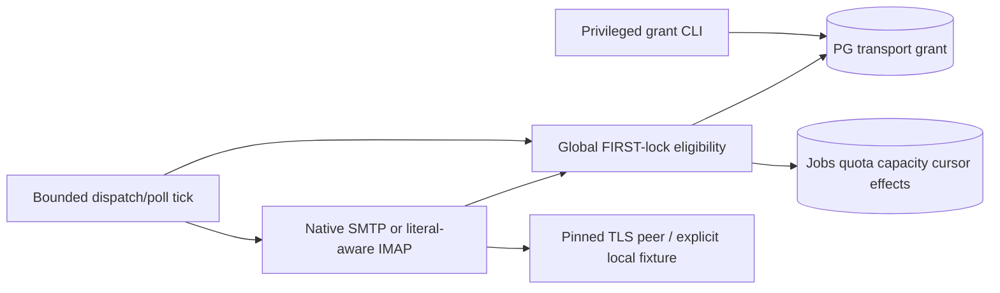

# F09 — architecture delta

## Architecture Overview

Distributed Monolith, existing Node22.20.0 native HTTP/TypeScript/pg/PostgreSQL16. No new service, library or generic mail engine. F08 diagnostic Channel is line-only and its authority is diagnostics-only: neither may be mistaken for a complete submission/IMAP literal implementation.

## Component Breakdown

Prospective paths within projects/07-cold-email-warmup only; integration owner assigns one writer per path before IMPLEMENT. Keep modules<500 lines.

| Area | Placement and exact reuse/delta |
|---|---|
| Transport authority | New src/mailboxes/transport-authority.ts and transport-operator.ts: per-mailbox grant/CAS, expiry and capability checks; src/config.ts allows disabled/local_test/live_provider, disabled default; operatorTokenDigest mandatory for publication |
| Network | Reuse src/mailboxes/network.ts validation, F08 pinned TLS construction/cleanup semantics; new bounded byte channel in src/mailboxes/transport-channel.ts supports literals/drain; F08 diagnostics behavior retained and regression tested |
| SMTP | src/dispatch/smtp.ts, adapter.ts outcome union, message.ts separate live serializer, submission.ts shared final fence/receipt; worker.ts explicit mode factory |
| IMAP | src/replies/imap.ts plus bounded header parser; adapter.ts provenance/mode interfaces, worker.ts production source guard; store.ts keeps existing transaction identity and semantic dedup |
| Eligibility | src/dispatch/eligibility.ts and store.ts, src/pool/store.ts retain current readiness/capacity/consent and add mode-specific grant predicates; pool recipient gets equal fence; no separate send queue |
| Invalidation | src/mailboxes/store.ts common cancelMailbox/settings/credential changes increment independent transport_revision; all stop writers continue shared lock; authority revoke invalidates poll proof and movable jobs |
| Storage | Additive db/014-live-transport.sql; db schema readiness version14 and typed config wiring reconciled by coordinator |
| Tests | tests/f09-live-transport.test.ts, tests/f09-live-protocol.test.ts, tests/expanded-mvp-03.test.ts and existing fixtures/helpers; no runtime test-CA selection |

## Technology Stack

| Layer | Technology | Rationale |
|---|---|---|
| Frontend | Existing shell, unchanged | No F09 UI scope |
| Backend | Native Node22.20.0 TLS/net/streams, strict TypeScript | Existing F08 pinning; finite audited protocol subset |
| Database | PostgreSQL16 and existing pg | Same final lock/atomic page effects |
| Cache | None | No second authority |
| Queue | Existing send_job/reply_rescan | Recovery semantics retained |
| Infrastructure | Existing Compose isolated network | DB no host port; local fixture acceptance only |

## External Dependencies

Primary pages opened2026-10-06; quotes and exact URLs in capability-contracts.md. CONFIRMED means documented primitive, not acceptance by any particular provider or live account authorization.

| Capability needed | Provider / API | Evidence | Verdict | Requirements relying on it |
|---|---|---|---|---|
| SMTP acceptance and reply classes | RFC5321 | §4.2.5 “positive completion status”; checked2026-10-06, capability-contracts.md | CONFIRMED | FR-f09-live-transport-003, FR-f09-live-transport-004 |
| Read-only UID headers | RFC3501/RFC9051 | EXAMINE “read-only”; checked2026-10-06, capability-contracts.md | CONFIRMED | FR-f09-live-transport-005, FR-f09-live-transport-006 |
| Password PLAIN authentication | RFC4954/RFC4616 | “235 2.7.0 Authentication successful”; checked2026-10-06, capability-contracts.md | CONFIRMED | FR-f09-live-transport-003, FR-f09-live-transport-005 |
| Verified pinned TLS and bounded backpressure | Node22.20.0 TLS/Stream | “servername”; checked2026-10-06, capability-contracts.md | CONFIRMED | FR-f09-live-transport-007, FR-f09-live-transport-008 |
| Seven-bit MIME encoding | RFC2045/RFC2047 | “Base64 Content-Transfer-Encoding”; checked2026-10-06, capability-contracts.md | CONFIRMED | FR-f09-live-transport-003 |

Provider-specific OAuth and account policies remain outside this slice and cannot be labelled confirmed by these protocol documents. No external LLM/payment capability is introduced. Prior canonical Nodemailer/ImapFlow descriptions are not installed dependency decisions for F09: retain native F08 approach, avoiding downloads and additional transitive surface; coordinator later reconciles accepted canon.

## Data Architecture

02_pseudocode.md owns logical fields. Migration maps TransportGrant to transport_grant keyed(tenant_id,mailbox_id) with mailbox composite FK; bigint revision checked monotonic through CAS, active/revoked constraint, capabilities validated finite JSON/array, endpoints/config/expiry required for active. Default no rows/authority. Add mailbox.transport_revision default0; existing encrypted envelopes untouched. TransportOperation maps to six seeded transport_operation slots with protocol and slot constraints, nullable operation owner/mailbox/expiry/process incarnation/host together and unique occupied(protocol,mailbox_id), INCLUDING expired rows. Process incarnation is a fresh UUID bound to the privileged local parent ChildProcess identity; host/container identity is recovery metadata, never a PID-only proof. Short FIRST-lock admission selects only unoccupied slots. Expiry flags unhealthy occupancy and cannot clear uniqueness or free a slot.

Submission receipt maps to transport_receipt keyed(job_id,attempt_count), tenant FK, mode enum(local_test,protocol_fixture,live_provider), message_id, accepted_at. Existing local sink keeps local_test_message semantics; live receipt does not expose body. send_job stores selected transport mode/revision for immutable attempt attribution; existing states unchanged. reply_rescan already permits imap_headers provenance; mailbox_poll owner/currentness and atomic semantic keys remain existing storage. Index grant by mailbox and expires_at, no unbounded global history table.

## Security Architecture

All eligibility writers take pg_advisory_xact_lock(7,1) FIRST after BEGIN, then rows in consistent order. Final submitting COMMIT is irreversible; network starts afterwards. Revoke/stop winning before this commit blocks; later stop leaves at most one in-flight attempt, and recovery retains quota. Grant revision and mailbox transport_revision fence identical replacement/stop-resume ABA. DB time after lock decides expiry/day. The synchronous beforeCommit callback closes the abort-to-COMMIT submission gap; no claim that abort can revoke an already submitted COMMIT.

The existing verified_test state remains an explicit local readiness prerequisite for capacity and scheduling; it does not prove live verification. Operator grant supplies separate authority; diagnostics alone cannot change either. No new verified_live enum or broad control plane. Capacity still requires deliberate activation and existing consent; production grant cannot bootstrap them. F10 can persistently schedule many authorized mailboxes because grants are keyed per mailbox rather than F08 singleton.

Transport slots bound physically owned open socket operations across processes: expiration leaves occupancy and per-mailbox exclusion intact. No global transaction lock crosses sockets. Normal release follows an irreversibly sealed operation plus confirmed close of all its underlying raw/TLS handles; socket end, destroy request or protocol close response alone cannot release. A child process owns its socket descriptors exclusively, with no handle transfer or socket-owning descendants. A narrow lifetime guard in the existing privileged worker entrypoint binds each ChildProcess object to an ownerProcess UUID before I/O. On stuck cleanup it attempts5s graceful termination then SIGKILL and≤5s exit wait; only confirmed exact-child exit permits CAS release. Signal delivery/killed=true alone does not prove termination. An unresponsive guard can reduce availability, never create another socket in an occupied slot. A stale owner cannot renew/release another slot or publish results. Connect checks remaining deadline before any I/O; all fault seams remain explicit test construction: before final lock, sync beforeCommit, afterCommit before adapter, body write/terminator/final reply, capture/page before/after commit, source revoke. Real local TLS fixture CA/dial override exists only via trusted constructor, never HTTP/env/main. Secret canaries include base64 PLAIN and hostile peer text.

## Bounded restart and database-failure recovery

This is lifetime cleanup for existing workers, not a general control plane. Store at most six identity-bound close/exit acknowledgements pending DB release. Release always compares operation+process+host identity under FIRST lock; failed/unknown DB commits are retried idempotently, while rows stay occupied. A restarted parent cannot attest orphan death; privileged cleanup must confirm the exact old process or, if its child binding was lost, confirmed complete termination of its exact isolated worker container before clearing corresponding slots. Record the container incarnation in process ownership metadata at launch; never target a replacement by reused name/PID. No cross-host reclaim without authenticated local termination proof; unreachable hosts remain blocked. No manual force-free based only on age. The10s recovery attempt can end cleanup_blocked; a later bounded attempt handles changed evidence, without resetting SMTP unknown or retrying delivery. F10 must preserve these physical limits during restart/fair scheduling and expose unavailable capacity rather than replacing orphan slots.

## Scalability Considerations

SMTP2/IMAP4 global, one each per mailbox; six small operation rows, finite local queues and deadlines. F10 supplies durable due scheduling, fairness, restart loop and30active cadence; no F09 fairness/SLO claim. Numeric UID windows deliberately trade throughput for bounded proofs; a sparse or huge mailbox may remain visibly incomplete across retries. Do not skip ranges to meet cadence. Pilot remains100connected/30active with120s capacity leases and shared quotas.

## Reconciliation with Pseudocode

Расхождений с `02_pseudocode.md` не найдено. Сверены сущности: TransportGrant, mailbox.transport_revision, TransportSnapshot, TransportOperation, SubmissionOutcome/receipt, Snapshot/HeaderPage/Rescan. Алгоритмы: Publish and authorize transport; Commit final send eligibility; Serialize and submit SMTP; Persist failure classification and recover; Read proven UID range; Apply fenced rescan pages; Own bounded resources; Separate secrets and evidence modes; Accept source-bound adapter behavior. F09-V1 correction additionally reconciles TransportOperation ownerProcess/ownerHost identity, occupied-expired semantics and confirmed-close/exit CAS release. Physical mapping preserves revision types, state enums and operation ownership; no duplicate field canon.
