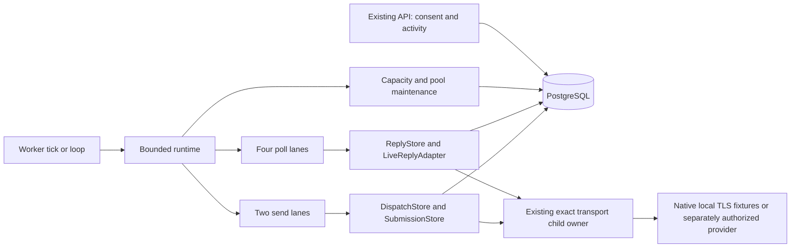

# F10 — архитектура постоянного runtime

PLAN / AUTO, attempt f10-plan-a2, 2026-10-06. Исходный partial commit7c8f7334e2950fe9326034e0184ba4f3b7d5ef4e; parent baseline2248aa17. Точечная коррекция F10-V1 (f10-plan-r3) согласует durable mailbox rotation с01/02; остальные контракты сохраняются. Это placement и физическое отображение их контрактов, не приёмка реализации.

## Architecture Overview

Существующий distributed monolith Node22/TypeScript/PostgreSQL16 получает один отдельный persistent worker entry point. Web/API остаётся владельцем пользовательского consent/activity; worker потребляет durable intent. Worker содержит независимые poll/send lanes и ограниченный maintenance цикл. Он не является новым general control plane.

## Component Breakdown

| Boundary / future path | Responsibility and existing donor | Criteria |
|---|---|---|
| src/runtime/worker.ts, src/runtime/loop.ts | CLI lifecycle, bounded lane set, cancellable waits, drain and readiness; existing worker wrappers remain explicit tick | AC001, AC003, AC007 |
| src/runtime/store.ts, additive SQL in existing db migration directory | Durable due claims, tenant turn, CAS generation, bounded keyset reconciliation, typed reasons | AC001, AC002, AC006 |
| src/replies/worker.ts, src/replies/adapter.ts, src/replies/store.ts | Extract one operation/page quantum from PollWorker; compose due/poll/grant fence with atomic page/stop transaction; propagate AbortSignal | AC002, AC003 |
| src/mailboxes/capacity.ts | Renew existing requested leases, fair waiting admission, preserve deactivate and global30 bound | AC002 |
| src/dispatch/store.ts, src/dispatch/submission.ts | Tenant-aware claim, current pacing and pair-day check inside final fence; retain single irreversible transition | AC004 |
| src/pool/store.ts | Automatic consent-derived allocation, bounded peer cursor and skip conflict, reply/initial uniqueness and backlog bound | AC005 |
| src/mailboxes/transport-slots.ts, transport-lifetime.ts | Reuse physical slot admission, exact child lifecycle and retained close proofs; no expiry-based reclaim | AC001, AC003 |
| src/config.ts, package.json, docker-compose.yml | Thin runtime configuration/command wiring; disabled defaults and explicit profile; coordinator-owned integration changes | AC007 |

These paths are a future implementation split; no implementation writer is dispatched by this PLAN. Coordinator assigns exact file ownership and migration number before IMPLEMENT. No manifest/dependency/lockfile changes occur during planning. Existing native adapters, protocol budgets and tenant AEAD remain; no new runtime dependencies are required.

## Data Architecture

Logical field authority is exclusively02_pseudocode.md, Data Structures. Map RuntimeDue→runtime_due, RuntimeTenantTurn→runtime_tenant_turn, RuntimeMailbox→runtime_mailbox via additive migrations. Each mailbox relation has composite tenant/mailbox foreign ownership binding; unique(mailbox,kind) and unique(tenant,kind) enforce the logical identities. Use timestamptz for timestamps, date for UTC pool_day, bigint for generation/service sequence, UUID for IDs/cursor; CHECK constraints preserve the exact enums in02. Do not maintain a second consent or capacity ledger.

Index eligible-mailbox service ordering by(kind,tenant_id,service_seq,due_at,mailbox_id), with due_at<=now/next_check_at<=now and claim state as eligibility filters; retain a separate(kind,next_check_at) index for bounded wakeup lookup. Index tenant rotation by(kind,service_seq,tenant_id), and mailbox metadata by tenant/mailbox. RuntimeDue.service_seq starts0 only on INSERT; the same FIRST-lock selection transaction assigns fresh PG sequence values to tenant and selected mailbox before I/O, including turns later returning busy/failure. Completion and reconciliation preserve those values, so an older continuation cannot precede an unserved eligible mailbox solely by due_at. Bounded due SELECT uses SKIP LOCKED, but all eligibility mutations still acquire global(7,1) FIRST; SKIP LOCKED never replaces this serialization. Sequence gaps from rollbacks are harmless ordering tokens, not counts of delivered messages. Restart keeps original due_at and persisted service order; a heartbeat cannot reset starvation age.

Existing capacity_lease rows remain activity intent. Deactivation deletes intent and must not be reversed by reconciliation UPSERT. Existing consent/pool_member relationship remains authoritative. Existing send_job pair_key and unique initial pair/day and parent reply constraints are retained; metadata cursor does not create authority. Existing send_job claimed45s and submitting/unknown reservations are not converted to runtime leases. Runtime120s lease merely fences quantum state.

Reply quantum extraction reuses reply_rescan.run_id, uidvalidity, cursor_uid, high_water, tail_high_water, attempt, pages and attempt_started_at. After an initial snapshot, capture persists its horizon; subsequent quantum reads an eligible range. When scan cursor reaches high_water, a separately completed fresh snapshot captures tail_high_water in a small guarded transaction before yielding; this needs a narrow ReplyStore helper using the same identity and current source guard. Fetch/page then consumes that fixed tail; no process-local horizon survives as evidence. Completion requires existing page proof, never scheduler bookkeeping. rescan_incomplete is a durable hold: only the existing explicit retry transition with current identity can start another bounded attempt; an ordinary tick may not clear it or manufacture completed_at. Independent VALIDATE must verify that the planned retry caller has the required authority and that this extraction preserves existing semantics.

## Transactions and cancellation

Runtime claim transaction uses checked-out pg client: BEGIN → pg_advisory_xact_lock(7,1) → current DB clock/rows → owner+generation CAS → COMMIT. Existing helpers that independently open transactions must be factored into client-level variants when composed; calling claimPoll or CapacityStore.act inside another locked transaction on a second connection is forbidden. Keep consistent global lock before installation/mailbox/due/job row locks. All decrypt/connect/protocol operations remain outside DB transactions where currently required; network never occurs inside.

A page transaction atomically validates runtime owner/generation, mailbox_poll owner, source/grant revisions and existing Rescan identity, then persists observations, semantic stops, cursor and progress. Losing either generation or poll ownership rejects mutation; neither identity proves socket closure. Claim expiry cannot start another physical operation when the F09 mailbox slot remains occupied.

One AbortController propagates from process shutdown through poll adapter and submission to runTransportChild. A timeout rejects work and cancels the underlying owner; the runtime joins its cleanup before assigning the lane again. Existing SIGTERM5s/SIGKILL5s waits require actual exit confirmation. PG connection/query waits are bounded by the drain contract; stopped admission plus retained slot occupation is the safe outcome when cleanup proof or DB writes fail. No promise-race loser is abandoned with an open socket.

## Security Architecture

Every send still runs SubmissionStore's final current-state fence under FIRST global lock: sender and pool recipient consent/activity/freshness, config/grant expiry, suppression/complaint/campaign state and current UTC shared quota. Pacing state commits with submitting and survives crashes. Pool enrollment uses existing affirmative disclosure, never checking a box or granting activity on save. All queries bind tenant ownership; only explicit consenting peer relationships cross tenants for pool matching. Logs contain opaque IDs, enum reasons and timings; no raw headers/body/server lines, credentials or key material.

Config keeps disabled/local_test/live_provider distinctions and independent SMTP/IMAP grants. Fixture CA/dial/port injection remains only a trusted constructor capability. Worker gets scoped existing runtime files, never the Docker engine socket. Billing configuration stays disabled/local_test. F10 neither generates AI content nor extends ai-policy-v1 authority.

## Scalability Considerations

100 connected/30 active/≥3 tenants is the approved measured A1 fixture workload, not a global connected cap. Reconciliation keyset pages≤100; at most30 active peer candidates per sender quantum; no full list of unlimited records or unbounded promises. Tenant AND mailbox rotation occur durably on selected work even if the operation fails; next_check separates backoff eligibility from original due age. Four old same-tenant rescans must yield to a later-due unserved healthy mailbox before taking another quantum; restart preserves that service order. Poll4 and send2 capacity are independent; maintenance cannot wait for SMTP completion. A rescan yields after one protocol quantum while preserving20page/120s attempt bounds.

Successful complete poll proofs use existing runtime_due fields only: the owner/generation-fenced finish sets due_at and next_check_at to post-lock DB now, preserving service_seq. This is immediate eligibility for fair selection, not same-mailbox chaining or extra concurrency. Unfinished work retains original due age; failed/busy/held work follows unchanged backoff/hold rules. No poll-round timestamp or reply_rescan clock reuse is needed because cadence scheduling no longer uses a round-start+30 anchor. Awaited quantum/cleanup and an asynchronous event-loop yield precede the next claim; record CPU/RAM, operation counts and other lane progress under repeated successful empty polls. Existing durable completed_at remains the evidence of actual full proof, independent of scheduling timestamps.

Healthy poll≤30s, due round≤60s and pool round≤300s are acceptance targets measured per participant. Slow providers, orphan slots and outages remain visible misses/blocked states. Fixed slots prevent resource escalation to hide overload. Queue class precedence and retry pacing follow01/02; no invented aggregate throughput guarantee.

## External Dependencies

| Capability needed | Provider / API | Evidence | Verdict | Requirements relying on it |
|---|---|---|---|---|
| Native SMTP/UID/TLS and exact child close/exit semantics | Existing Node22.20.0 F09 adapters | [F09 capability contracts](../f09-live-transport/capability-contracts.md), checked2026-10-06 primary pages and short quotes; accepted F09 review e043bb27 composition | CONFIRMED | FR-f10-durable-runtime-001..004, local existing primitives only |
| Durable transaction/row lock/unique admission | Existing N7 PostgreSQL16 path | Actual eligibilityTransaction, DispatchStore, ReplyStore, transport-slots and accepted F09 PG tests; implementation evidence, no new provider capability claim | CONFIRMED | FR-f10-durable-runtime-001..006, local PG reuse |
| External account SMTP/IMAP access and permission | Operator-selected mail provider | No account permission or new provider proof in F10; existing local evidence cannot supply it | UNCONFIRMED | Future live operation only; not local F10 fixture implementation |

No primary page was newly opened in this bounded continuation; CONFIRMED describes inherited source-bound contracts, not a fresh provider verification. External permission and F15 stay separately blocked. Broader parent library suggestions are superseded by accepted native F09 implementation for this slice.

## Reconciliation with Pseudocode

Расхождений с `02_pseudocode.md` не найдено при mapping указанных logical fields: RuntimeDue, RuntimeTenantTurn, RuntimeMailbox, CapacityLease, Rescan и TransportSlot. Сверены алгоритмы: Start drain and recover; Fair polling and capacity maintenance; Preserve finite physical ownership; Claim paced dispatch and recheck final fence; Allocate pool automatically without duplicate backlog; Persist overload and backoff; Wire and verify local runtime. Type/enum/field authority remains02; architecture adds indexes/client-level composition and existing tail horizon persistence without another enum or evidence field. Это сверка PLAN, не independent VALIDATE. Retry authority, fairness under a long rescan, orphan availability and cross-midnight pair interpretation remain explicit review targets in04.

## F11 C1 conditional scheduling amendment

The original unconditional immediate-eligibility component is superseded only for a selected legal capture by the owner-authorized independent A5 amendment (report SHA256 `8c4c56ba9a6e1fd72554af856e674a27b7e8092802e4b4218b0d625e0818f772`, sealed 2026-10-07T00:28:55.922873Z). No-body success retains its original immediate eligibility and selected service order. F11 implementation and acceptance remain pending.

> A successful current owner/generation-fenced complete poll retains its selected tenant/mailbox fair turn. If no currently authenticated, unexpired owned capture intent is selected atomically, finish sets due_at=next_check_at=post-lock DB now, with no successful-poll sleep. If exactly one eligible owned pending capture is selected after complete proof, finish may instead set due_at=next_check_at=T+5 seconds, where T is this finish transaction's post-lock DB clock. Persist that capture's single absolute window [T,T+5s), bound to the exact complete proof, current run/attempt/source/UIDVALIDITY, event/generation and authority/config revisions. Both metadata and text are separate quanta of the existing four IMAP jobs and must fit inside this one window; there is no second window for text. Every admission, native deadline and result commit checks the fixed end, with each stage budget at most min(5s,end-now). The window is neither renewable nor transferable. No body may start while its mailbox has due, claimed or incomplete header work. At end, header work is due without requiring a cleanup callback; unfinished capture fails closed to a typed held timeout/cancellation outcome. A later poll, replay, retry, restart, phase transition or lease cannot reopen or extend that same capture window. Body results never alter header cursor/completed_at or reset selected service order. Native cancellation and exact closure rules remain mandatory; unconfirmed closure remains occupied/cleanup_blocked. All thirty participants must still meet actual healthy complete-poll gaps<=30s and fair due selection<=60s in the required competing-worker witness.

This is one absolute five-second window for BOTH separately scheduled phases, not two renewable five-second windows. Two worst-case five-second stages cannot fit; required legal-positive ALL30 body liveness and healthy complete-poll≤30s/fair-selection≤60s must be proved by actual native competing-worker evidence before acceptance. All-timeout/all-held or never-selected captures fail the liveness gate. Native old-UID header revalidation must authenticate current root/recipient/run/source without manufacturing full-poll freshness; relabeling a stale observation is forbidden. New encrypted phase copies inherit terminal24h/absolute7d expiry and physical purge. Runtime body stays OFF until required witnesses pass.

## F11 C1 scheduling amendment v2: capacity-admitted fixed window

The infeasible A5 one-five-second-total-window proposal above is retained as history and superseded by independent A7 report SHA256 `5933553b035e0e73ee8027ef90daef1608612b6bcee15ecdcaacf3af0e60b0b7`, sealed 2026-10-07T00:56:47.172969+00:00. Its legal two-2800ms-stage counterexample remains unresolved by the old policy; no success or gate reduction is inferred. This additive scheduling strategy is READY for implementation only. Original no-body immediate eligibility, selected fair turn, each-stage5s and ALL30 header30s/selection60s remain mandatory.

> Body executes only as an alternative quantum in the existing four IMAP jobs, with two SMTP jobs and existing pool/maintenance unchanged. There are at most three concurrently admitted capture windows globally and at most three physical body operations; at least one physical IMAP slot remains unavailable to body and all four remain usable by normal header polling. Pending captures wait in durable age/service order; newer arrivals and second phases cannot overtake older unserved capture turns. Pending queue age never resets. A capture window opens exactly once, only when an existing IMAP job has settled its header operation and exact cleanup, and a current owner/generation-fenced complete poll proof, authentic current native UID/header/root/recipient observation, current activity/authority/config and an available physical first-phase slot permit the same FIRST(7,1) transaction to finish header scheduling, claim the capture and acquire that slot. In that transaction header state becomes ready and due_at=next_check_at=T+12s, window_start=T, window_end=T+12s; selected tenant/mailbox service_seq remains unchanged. If those conditions are absent, successful finish remains due_at=next_check_at=T immediately. Unadmitted pending captures never receive a speculative12s header delay or a short expiring window while waiting for capacity.
>
> Metadata and text are separate quanta. Each has its own native operation budget at most5s, shortened by remaining absolute window and inherited content deadline. Metadata must settle exact native closure before commit/yield; text reacquires its claim and physical slot under the same FIRST lock on a later existing-job turn. Active text/metadata continuations are selected by fixed window end then original capture service order, ahead of opening further windows; urgent actual header deadlines retain priority. Both phase commits must occur before the original window_end, and all current identity/stop/grant/config/source/run/UID/root/recipient/generation checks remain valid. No body admission occurs while that mailbox has actually due, claimed or incomplete header work. At end header becomes due independently of callbacks; no renewal, transfer, phase/retry/restart/replay extension or caller bypass is allowed. Native abort propagates; unconfirmed exact closure stays physically occupied/cleanup_blocked, and missed deadlines remain visible.
>
> This v2 strategy is READY for the authorized bounded implementation step; fleet feasibility and F11 acceptance remain UNPROVEN/BLOCKED. The candidate must prove actual both-phase liveness for all30 legal positive captures including2.8+2.8s responses, actual complete-poll gaps<=30s and fair due selection<=60s, with original participant denominator and fixed resources. Timeout/hold/never-selected cannot count as positive liveness. No production body admission until the exact source/build/config witnesses and fresh final independent review pass.

A capture receives one absolute attempt deadline min(inherited content expiry, first durable authenticated queue eligibility+450s), never a window-start/restart/replay clock. The finite thirty-capture queue estimate is conditional; the mandatory positive native witness must make ALL30 both phases ready<=240s including two2800ms stages each, and continue full300s load evidence. Window/attempt expiry never renews same capture. This is not a relaxation of the later arrival-to-SMTP300s SLO. Unknown closure stays occupied. Current genuine source/UID/root/decrypted-recipient/grant/config/generation/stop fences, copy terminal24h/absolute7d and physical purge remain mandatory. Production entry may be implemented under current transport authority and disabled defaults, but candidate deployment/provider enablement and F11 acceptance remain closed until the mandatory witnesses and NEW independent source review pass.

## F11 native FIFO HEADER scheduling exception (A31)

In the existing native F11 BODY context path only, when current enabled configuration and current transport grants authorize both HEADER and BODY for a real pending immutable-age imap_headers capture in the existing oldest-three unwindowed frontier, an existing IMAP lane may guide its next genuine HEADER quantum toward that frontier before general fair polling. The preference is recomputed under FIRST(7,1), creates no window, claim, physical reservation or evidence by itself, and is available only with fewer than three live admitted windows, no runnable admitted continuation, actual free nonreserved BODY capacity, BODY+UNKNOWN below three, and the exact single HEADER reservation retained. Among eligible HEADER candidates, actual urgent HEADER deadlines have first priority, then authorized frontier HEADER work, then ordinary HEADER work; each tier retains tenant turn then mailbox service_seq/due_at/id ordering and advances BOTH turns on every committed selection, including subsequent busy/failure. Urgency uses the existing actual completed_at+30s<=post-lock-now+5s predicate, treating missing completion as urgent; no deadline is renewed or fabricated. For a genuine currently authorized pending capture among the original oldest three unwindowed records or a live admitted capture among at most three admitted windows, the urgent HEADER tier remains available independently of first-window frontier capacity; it never admits BODY or creates proof. Once no such authorized native BODY context remains, the original fair HEADER selection applies unchanged. Every quantum still joins exact cleanup and yields before another claim. No-body or denied admission remains due_at=next_check_at=post-lock DB NOW, with no phantom deferral. Only its same-mailbox current owner/generation-fenced completed genuine poll plus the unchanged full admission fences and an actually acquired first-phase slot may atomically open the single12s window and defer that mailbox's HEADER to its fixed end. Existing continuation fixed-end/service ordering, local due/claimed/incomplete rejection, reserved HEADER capacity and all30s actual HEADER/60s due selection/240s ALL30/full300s gates remain mandatory.
