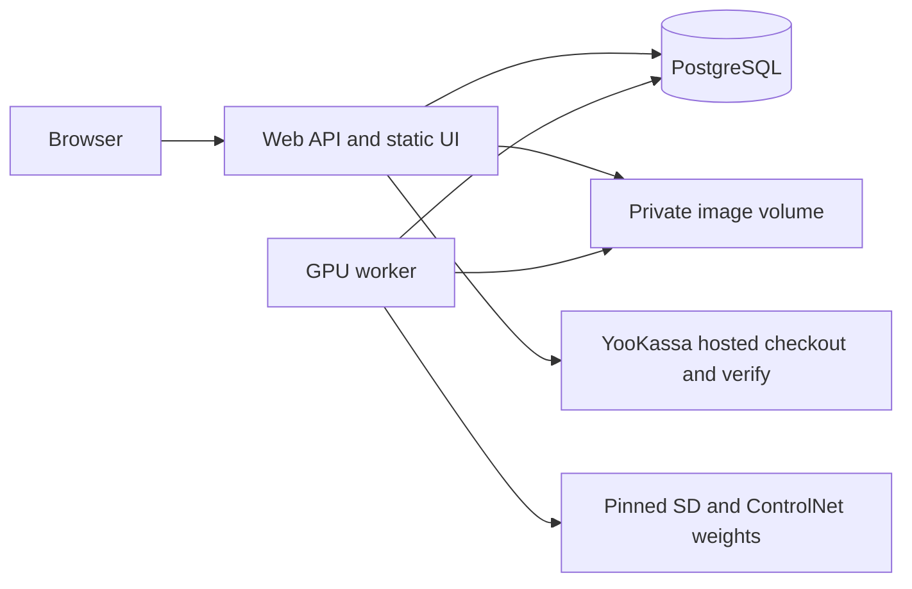

# RoomKind — Architecture

## Architectural style
Distributed monolith in one project directory: Node22 web/API serves a static accessible UI, PostgreSQL16 holds durable state and queue, Python worker runs SD+ControlNet-depth. Docker Compose joins private services. Simple ESM modules and browser JavaScript avoid an unnecessary UI build layer; this is an explicit minimal-stack choice, not a hidden replacement of geometry inference. Shared toolkit stays at repository root.

## Components and boundaries

API: register/login/logout/me; upload/read/delete; create/list/get job; create/get payment intent; incoming payment notification; authorized composite export; publish/revoke and public share/gallery. No request-supplied remote fetch URL. Web authenticates before media reads; worker trusts only leased DB rows and UUID keys.

## Technology Stack

| Layer | Selection | Reason |
|---|---|---|
| Web | Node22 ESM, node:http, pg, bcrypt, sharp | Small auditable surface, donors supply compatible patterns |
| UI | HTML/CSS/JS, native forms and slider | CJM can become running UI without build-heavy framework |
| Persistence | postgres16, SQL migrations | Atomic credits, jobs, idempotency and provenance |
| Worker | Python, psycopg, torch, transformers, diffusers, Pillow | Explicit depth-conditioned generation |
| Packaging | Docker Compose, separate GPU profile | Reversible isolated local test; no shared deployment edits |

Donor pinned versions are candidates, not automatic current-version recommendations; lockfile and dependency audit required before code acceptance. GPU weights/config pins and license decision are recorded before download. GPU image is not built on this resource-limited host until coordinated.

## External Dependencies

| Capability needed | Provider / API | Evidence | Verdict | Requirements relying on it |
|---|---|---|---|---|
| Create payment with idempotency and metadata | YooKassa payments | https://yookassa.ru/developers/payment-acceptance/getting-started/payment-process · checked 2026-10-02 · «ключ идемпотентности»; «Данные необходимо передавать в объекте metadata» | CONFIRMED | FR-payment-1 |
| Inspect actual payment status after incoming notification | YooKassa API/webhooks | https://yookassa.ru/developers/using-api/webhooks · checked 2026-10-02 · «Проверьте текущий статус объекта» | CONFIRMED | FR-payment-1, FR-GROWTH-002, FR-GROWTH-004 |
| Depth-conditioned Stable Diffusion generation (self-hosted library, not cloud API) | Hugging Face Diffusers | https://huggingface.co/docs/diffusers/api/pipelines/controlnet · checked 2026-10-02 · “preserve the spatial information from the depth map” | CONFIRMED | FR-geometry-1 |

The confirmed capability is spatial conditioning, not guaranteed geometry quality or 25-second latency. Real geometry/performance remain acceptance measurements. No runtime OpenAI image dependency. Provider live mode unavailable until merchant credentials and separate external-effects authorization; fixture adapter is explicit local test functionality.

## Data Architecture
`Pseudocode.md / Data Structures` owns field names/types/enums. Each entity maps to a PostgreSQL table; UUID PKs, owner FKs and unique constraints for email, idempotency, provider payment, ledger reference, share token and event dedupe. Account row lock serializes credit mutations; check balance and reserve live in same transaction. Budget bucket locks use stable global→account order. Network/hash/image operations occur outside transactions. Payment/account lock order remains consistent; no database port is published.
Storage volume has originals/reencoded uploads, per-attempt temporary output and composites. Never expose the volume with a static file mount. Atomic rename prevents half-written images; lease fence guard prevents orphan late output becoming visible. Orphan sweeper only known UUID files older than safe interval, excluding live job references.

## Security Architecture
Passwords bcrypt cost10 following N5; HMAC hashed 32-byte opaque tokens following N5, expiry7d and revocation. Generic login errors and dummy hash. Origin/CSRF checks, rate limits and body caps. Cookie Secure outside loopback local test. Owner-bound SQL access checks cover jobs, uploads, payments and composite generation. Public share accesses only non-revoked accepted composite; no raw filename, original or contact information. All rendered user text escaped.
YooKassa event authenticity uses authenticated provider GET, not invented HMAC signing. Unknown/mismatched provider response fails closed before ledger effects. Fake payment adapter disabled in production; same handler logic checked with replay/concurrent notifications.

## Runtime and bounded effects
Web bound through `${WEB_PORT:-18088}` on127.0.0.1, PostgreSQL only internal expose. Local compose includes random supplied DB credential and CPU/memory caps. Worker fixture profile is unmistakably labelled and refuses production; real GPU profile requires CUDA and actual model revisions. No silent CPU/mock fallback. Daily attempt200 and account20, max2 attempts/job, 180s deadline, heartbeat10s, lease30s. These are design values pending benchmark, not vendor guarantees.

## Reuse decision
PD-REUSE-001: N5 auth service and YooKassa response validator adapted; N6 job fencing/idempotency and orphan-cleanup semantics adapted. N6 tariff/commission code rejected wholesale because it grants time plans and financial commissions rather than generation credits. N5 Redis/S3 transport rejected for MVP because this task requires Postgres queue and can use a private volume. File SHA and security deltas in `reuse-inventory.md`.

## Reconciliation with Pseudocode
Расхождений с `Pseudocode.md` не найдено на документной сверке. Сверены сущности: account, session, upload, job, credit_ledger, payment_intent, provider_event, partner, attribution, share, event, attempt_budget; алгоритмы: Account sessions, Receive image, Reserve job, Geometry evidence, Gallery, Provider purchase, Share, Attribution, Composite, Partner registry, Publish/revoke, Boundaries, Budget. Physical schema has not been generated yet; schema reconciliation must be repeated against code.

## Scalability Considerations
One GPU worker initially, SKIP LOCKED permits later workers without changing ownership semantics. Pending jobs bounded per account. API pagination max50 and bounded response. GPU throughput and model warmup dominate latency; no speculative cache or batching until measured. A missing GPU blocks actual inference acceptance, not independent API/fixture verification.
