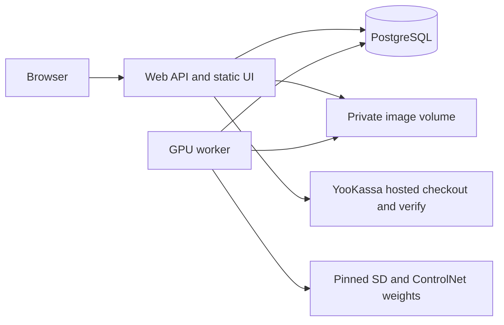

# RoomKind — Architecture

## Architectural style
Distributed monolith in one project directory: Node22 web/API serves a static accessible UI, PostgreSQL16 holds durable state and queue, Python worker runs SD+ControlNet-depth. Docker Compose joins private services. Simple ESM modules and browser JavaScript avoid an unnecessary UI build layer; this is an explicit minimal-stack choice, not a hidden replacement of geometry inference. Shared toolkit stays at repository root.

## Components and boundaries

API: register/login/logout/me; upload/read/delete; create/list/get job; create/get payment intent; incoming payment notification; authorized composite export; publish/revoke and public share/gallery. No request-supplied remote fetch URL. Web authenticates before media reads; worker trusts only leased DB rows and UUID keys.

## Technology Stack

| Layer | Selection | Reason |
|---|---|---|
| Web | Node22 ESM, node:http, pg, bcrypt, sharp | Small auditable surface, donors supply compatible patterns |
| UI | HTML/CSS/JS, native forms and slider | CJM can become running UI without build-heavy framework |
| Persistence | postgres16, SQL migrations | Atomic credits, jobs, idempotency and provenance |
| Worker | Python, psycopg, torch, transformers, diffusers, Pillow | Explicit depth-conditioned generation |
| Packaging | Docker Compose, separate GPU profile | Reversible isolated local test; no shared deployment edits |

Donor pinned versions are candidates, not automatic current-version recommendations; lockfile and dependency audit required before code acceptance. GPU weights/config pins and license decision are recorded before download. GPU image is not built on this resource-limited host until coordinated.

## External Dependencies

| Capability needed | Provider / API | Evidence | Verdict | Requirements relying on it |
|---|---|---|---|---|
| Create payment with idempotency and metadata | YooKassa payments | https://yookassa.ru/developers/payment-acceptance/getting-started/payment-process · checked 2026-10-02 · «ключ идемпотентности»; «Данные необходимо передавать в объекте metadata» | CONFIRMED | FR-payment-1 |
| Inspect actual payment status after incoming notification | YooKassa API/webhooks | https://yookassa.ru/developers/using-api/webhooks · checked 2026-10-02 · «Проверьте текущий статус объекта» | CONFIRMED | FR-payment-1, FR-GROWTH-002, FR-GROWTH-004 |
| Depth-conditioned Stable Diffusion generation (self-hosted library, not cloud API) | Hugging Face Diffusers | https://huggingface.co/docs/diffusers/api/pipelines/controlnet · checked 2026-10-02 · “preserve the spatial information from the depth map” | CONFIRMED | FR-geometry-1 |

The confirmed capability is spatial conditioning, not guaranteed geometry quality or 25-second latency. Real geometry/performance remain acceptance measurements. No runtime OpenAI image dependency. Provider live mode unavailable until merchant credentials and separate external-effects authorization; fixture adapter is explicit local test functionality.

## Data Architecture
`Pseudocode.md / Data Structures` owns field names/types/enums. Each entity maps to a PostgreSQL table; UUID PKs, owner FKs and unique constraints for email, idempotency, provider payment, ledger reference, share token and event dedupe. Account row lock serializes credit mutations; check balance and reserve live in same transaction. Budget/financial lock order is platform-day→account-day→account→intent→job when needed; operations starting at account never later request budget locks. Nonlocking candidate reads are rechecked under these locks, never job-first/account-second. Network/hash/image operations occur outside transactions; no database port is published. Admission reserves first attempt ticket atomically with credit/job; retries and UTC rollover require additional nonrefundable capacity tickets. Exhaustion after admission fails/releases exactly once.
Storage volume has originals/reencoded uploads, per-attempt temporary output and composites. Never expose the volume with a static file mount. Atomic rename prevents half-written images; lease fence guard prevents orphan late output becoming visible. Orphan sweeper only known UUID files older than safe interval, excluding live job references.

## Security Architecture
Passwords bcrypt cost10 following N5; HMAC hashed 32-byte opaque tokens following N5, expiry7d and revocation. Generic login errors and dummy hash. Origin/CSRF checks, rate limits and body caps. Cookie Secure outside loopback local test. Owner-bound SQL access checks cover jobs, uploads, payments and composite generation. Public share accesses only non-revoked accepted composite; no raw filename, original or contact information. All rendered user text escaped.
YooKassa event authenticity uses authenticated provider GET, not invented HMAC signing. Unknown/mismatched provider response fails closed before ledger effects. Fake payment adapter disabled in production; same handler logic checked with replay/concurrent notifications.

## Runtime and bounded effects
Web bound through `${WEB_PORT:-18088}` on127.0.0.1, PostgreSQL only internal expose. Local compose includes random supplied DB credential and CPU/memory caps. Worker fixture profile is unmistakably labelled and refuses production; real GPU profile requires CUDA and actual model revisions. No silent CPU/mock fallback. Daily conservative attempt-ticket caps200/account20 (lower configurable), max2 started attempts/job,180s fixed attempt deadline,60s queue expiry,360s absolute job deadline, heartbeat10s/lease30s capped by deadline. Every admitted ticket stays counted even if unused; retries require a new ticket. These are design values pending benchmark, not vendor guarantees.

## Reuse decision
PD-REUSE-001: N5 auth service and YooKassa response validator adapted; N6 job fencing/idempotency and orphan-cleanup semantics adapted. N6 tariff/commission code rejected wholesale because it grants time plans and financial commissions rather than generation credits. N5 Redis/S3 transport rejected for MVP because this task requires Postgres queue and can use a private volume. File SHA and security deltas in `reuse-inventory.md`.

## Reconciliation with Pseudocode
После независимых findings1–6 канон уточнён; повторные проверки и точечное закрытие последней LOW-регрессии завершены (цепочка receipts в telemetry). Сверены сущности: account, session, upload, job, credit_ledger, payment_intent, provider_event, partner, attribution, share, event, attempt_budget, attempt_ticket, generation_evidence, quality_review, verified_refund, first_conversion; алгоритмы: Account sessions, Receive image, Reserve job, Geometry evidence, Gallery, Provider purchase, Share, Attribution, Composite, Partner registry, Publish/revoke, Boundaries, Budget. F01 physical schema now defines account, session, credit_ledger and upload in `db/001-foundation.sql`; real PostgreSQL16 migration and transaction tests passed on source `29b070be`. Remaining entities are not implemented yet and require reconciliation at their feature boundary.

## Scalability Considerations
One GPU worker initially, SKIP LOCKED permits later workers without changing ownership semantics. Pending jobs bounded per account. API pagination max50 and bounded response. GPU throughput and model warmup dominate latency; no speculative cache or batching until measured. A missing GPU blocks actual inference acceptance, not independent API/fixture verification.

## Validation correction decisions
Refund hold is monotonic and checked under account serialization by admission, start/retry and final cached/private/public export authorization. Prior-authorized bounded stream or active inference may complete; later operations cannot spend or receive badge-free artifacts. Any partial/full verified refund binds refund→payment→immutable account/order and sets review, without guessed ledger reversal; no MVP unhold or monetary refund operation. Publication denies held accounts. Account-scoped first-paid marker makes exactly one committed success the conversion winner; no partner on first payment means no later backfill, and refund never promotes a second purchase.

`generation_evidence` binds immutable bytes/config/models/seed/timing to each result. Append-only operator CLI quality review binds actor/time/decision to output/evidence/corpus hashes; no public user quality setter. Runtime images start unverified, fixture never accepted. First-party partner tracking needs explicit unchecked consent; manual checkout code remains independently available. All41 named ACs map to scenarios in test-scenarios.md.

Refund source checked2026-10-02: [YooKassa notifications](https://yookassa.ru/developers/using-api/webhooks) names `refund.succeeded` and requires actual object-state verification; [refund lifecycle](https://yookassa.ru/developers/payment-acceptance/after-the-payment/refunds) describes refund status separately from payment status. Implementation must use the authenticated refund endpoint and its payment binding; do not invent a `payment.status=refunded` enum.

## F02b runtime mapping (2026-10-02)

F02a physical migration002 now implements jobs, tickets, conservative budgets and immutable generation evidence; acceptance is sourcec465ee73. Node controller reuses `createJobs` for every claim/heartbeat/complete/fail transition. Python never duplicates credit/SQL transitions, so psycopg is unnecessary in the selected minimal runtime. Controller spawns one bounded local Python inference process with an explicit JSON protocol; it cancels the process at a lost lease or fixed deadline and discards stale output. A persistent engine may cache loaded models for subsequent warm jobs; first/cold and later/warm timings remain distinct, and process restart clears warm state.

Only offline, operator-provisioned local model directories/manifests may load. Each manifest pins repository revision plus actual weight/config/license hashes; no runtime download, arbitrary URL, trust_remote_code or unsafe pickle. Intel DPT candidate has no listed safetensors: actual loading remains blocked until safe weights-only compatibility is verified or a documented compatible safe alternative is provisioned. Retain the SD safety checker. Missing CUDA/model/license/manifest fails explicitly; no silent fixture/CPU fallback.

Controller independently hashes bounded actual input/output/depth/config bytes outside transactions, then attaches immutable evidence through the existing fenced completion transaction. Private result reads recheck owner/tombstone/rejection and byte digest. Operator CLI is a separate trusted server command, with no public user setter. Append-only review stores actor/time/output/evidence/corpus digests; actual report validation must distinguish real measured corpus from synthetic software fixtures. A fixture can test rejection, never prove geometry. Quality rejection revokes read/public eligibility and performs existing unique release only if reserve existed.
