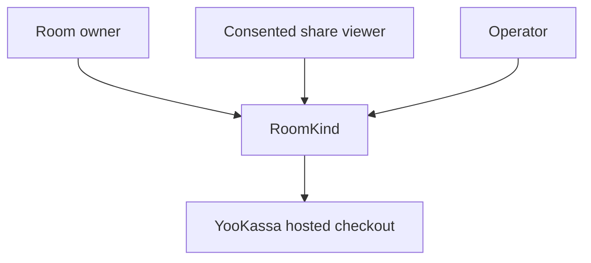
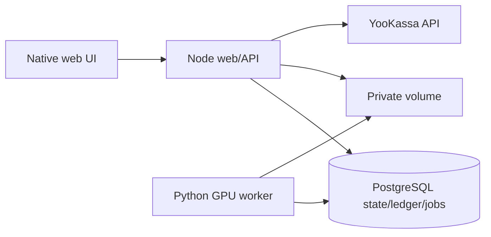

# RoomKind — C4 Context and Containers

Trust boundaries: browser cannot select amount/entitlement/owner; provider event requires independent verification; worker requires active fence; public viewer receives only consented composite. PostgreSQL has no host port, model weights never browser assets. Real GPU profile and explicit fixture profile represent different evidence classes.
