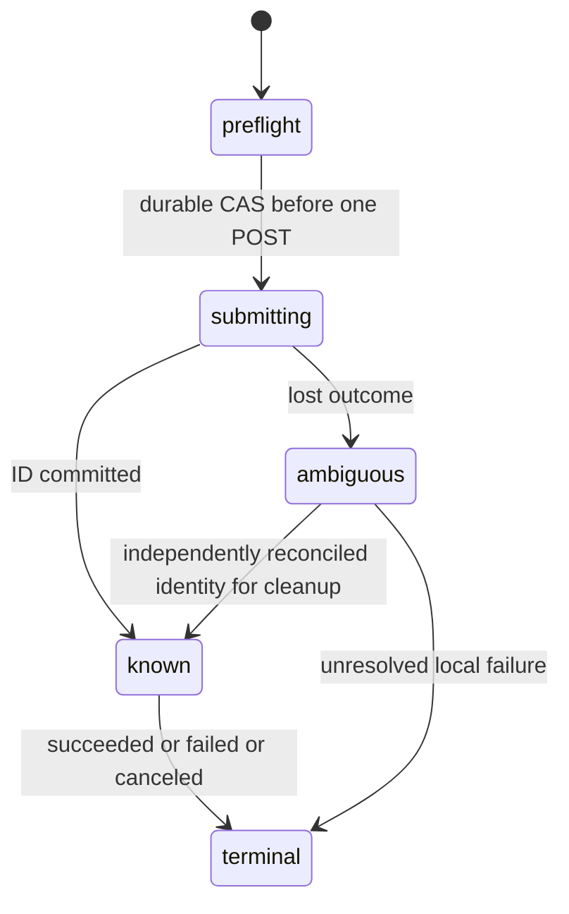

# F07 — Algorithms and state

Proposed on source `e2dded9898d8b00f2fa5613e5f5d3fb63281715b`. Preserve canonical `../../Pseudocode.md` lock order: attempt platform bucket→account bucket→account→job; submission/spend rows come after job. Owned completion/deletion takes account→job→submission. No network under locks. DB clock is authority; monotonic local timers are bounded by remaining DB duration.

## Data Structures

New `provider_submission`: id UUID, created_at Timestamp, job_id unique FK, attempt_number, attempt_ticket_id FK, submission_fence, provider=`replicate`, model, version64, contract_sha, source_input_sha, transmitted_input_sha, request_sha (never raw request), transform JSON, state, prediction_id unique nullable, provider_status nullable, attempt_deadline immutable, submitting_at, observed_at, cancel_requested_at, cancel_confirmed_at, cleanup_state, spend_reserved_microusd, billing_actual_microusd nullable. `state`: preflight/submitting/known/ambiguous/terminal. A job has at most one remotely submitted prediction in F07; local preflight failures can use existing retry policy without passing submitting. No retry after submitting, including definitive provider failure, in initial adapter.

New `provider_spend_budget`: id UUID, created_at Timestamp, authorization_id unique, currency USD, ceiling_microusd, reserved_microusd; immutable authorization scope/version/window and operator acceptance digests. This is an admission ceiling, not billing or customer credits. Reservations never automatically decrease; ambiguous charges count fully. Lock this single envelope row after submission; all writers follow that order.

Generation evidence gains mode=`replicate`, provider provenance schema version, submission_id/prediction_id, model version, contract/transmitted hashes, transform, raw_provider_depth/output hashes, normalized private hashes and timestamps. Preserve immutable evidence trigger. Hosted hardware/warm/predict_time/billed cost nullable with source fields. Do not fabricate sd/controlnet/depth Git revisions or reuse local manifest_sha. Original CUDA evidence validation remains intact.

## Core Algorithms

### Algorithm: Validate contract and prepare private input
REQUIREMENT: `FR-f07-replicate-1`
REQUIREMENT: `FR-f07-replicate-6`
REQUIREMENT: `AC-f07-replicate-2`
REALISES: SC-US-001-2
INPUT: worker config, claim, owned private bytes. OUTPUT: immutable prepared request or safe failure.
STEPS:
1. Validate `WORKER_MODE` fixture/controlnet/replicate, production fixture exclusion and existing source/seed/budget validation. Replicate mode requires fixed model/version/schema digest, runtime token, accepted privacy/license/contract and nonzero authorized spend envelope. Current envelope is0, so live create is disabled.
2. Read owned nondeleted upload with boundedRead; hash against upload.sha256. Decode≤20MP, single frame. Prepare deterministic512×512 letterbox with original aspect preserved; record content rectangle and original dimensions. JPEG encode without metadata at fixed quality85, then80, then75; require≤262144 bytes, otherwise fail before submitting (no automatic upload fallback). Hash transmitted bytes separately from original.
3. Construct only verified model fields: image data URI, fixed style prompt, a_prompt, n_prompt, num_samples="1", image_resolution="512", detect_resolution=512, ddim_steps=30, scale=7.5, eta=0, persisted integer seed. These are hosted settings, not unsupported img2img strength or conditioning-scale fields. Canonical request hash includes exact image bytes via data URI but retain only digest in DB/logs. Config artifact omits data URI/token and includes transform/hashes/contract.
4. RETURN prepared request bounded≤384KiB. No provider call on error. COMPLEXITY: O(image bytes), bounded.

### Algorithm: Durable one-shot submission
REQUIREMENT: `FR-f07-replicate-2`
REQUIREMENT: `AC-f07-replicate-3`
REQUIREMENT: `AC-f07-replicate-9`
REALISES: SC-US-002-1, SC-US-002-4
INPUT: prepared request and current claim. OUTPUT: known prediction or ambiguous/failed local outcome.
STEPS:
1. Account→job→submission→spend-envelope transaction: recheck live fence, lease, fixed deadline, nondeleted upload and no hold; existing consumed current-day attempt ticket must match. Insert preflight row if absent with immutable request/version/attempt/deadline binding. Matching row may continue; mismatch fails closed. If UTC changed before submission, use existing budget lock protocol to replace ticket in current UTC day, never decrement old counters.
2. Reserve conservative per-create cost ceiling in approved envelope; if unknown bound/missing authorization/exhausted, fail before network and unique-release job. Compare-and-set preflight→submitting, commit. Exactly one process sees this transition succeed. No other process can send this submission.
3. Immediately recheck abort/deadline and authorization state; if revoked, do not POST and mark known-unsent terminal if this sender can prove no send. A crash after durable submitting is always ambiguous to another process. Deletion between final check and POST cannot be atomically excluded across DB/HTTP; treat this as previously authorized remote work, reconcile/cancel and deny all local output.
4. Async POST fixed https://api.replicate.com/v1/predictions once, no SDK/HTTP retries or redirects; timeout=min(5s,remaining). Set Cancel-After=floor(remaining seconds−15), minimum5, otherwise refuse create. The15s margin reserves send/import/commit time; it is not a guarantee of remote billing stop. Provider queued/starting time consumes deadline from creation. Never send Prefer:wait.
5. Validate bounded≤512KiB response, prediction ID shape≤128 chars, exact version/model/status. Commit ID binding with CAS on submission.id/request_sha, unique provider ID, even if job fence expired: this write only establishes cleanup identity, never completion authority. If conflicting ID appears, quarantine and alert operator; never overwrite known ID.
6. Timeout/reset/5xx/malformed or oversized response/DB commit uncertainty after invocation => ambiguous unless original ID is durably known. Do not infer failure means uncharged; do not automatically replay even on429/4xx. Locally terminal/fence/release once under normal locks, retain spend/ticket reservation. Do not use list-and-prompt matching to guess identity.
7. RETURN known or ambiguous. COMPLEXITY: O(1) DB rows + bounded request.

### Algorithm: Observe and recover within original deadline
REQUIREMENT: `FR-f07-replicate-3`
REQUIREMENT: `NFR-f07-replicate-2`
REQUIREMENT: `AC-f07-replicate-4`
REQUIREMENT: `AC-f07-replicate-5`
REALISES: SC-US-002-2, SC-US-002-3
INPUT: submission ID, claim fence. OUTPUT: provider terminal observation or local termination.
STEPS:
1. Extend existing claim/maintenance code before its generic retry branch: running hosted known ID with expired lease and remaining original attempt time gets new fence/lease capped at old deadline, same attempt/ticket; two contenders serialize on account/job/submission. Submitting without durable ID after lease expiry becomes ambiguous and terminal locally. Never enter generic new-ticket/new-attempt path after submitting.
2. Heartbeat10s renews at most30s capped at original attempt_deadline/hard_deadline; heartbeat failure aborts HTTP/import. GET fixed API origin plus encoded validated ID every2s; 429 honors bounded Retry-After≤5s, transient GET faults backoff2/4/5s, max3 consecutive failures then local fail/cancel. All waits bounded by remaining deadline; no create retry. Do not follow response urls.get/cancel.
3. Accept starting/processing as nonterminal; succeeded only with matching identity/version and complete expected output shape; failed/canceled/aborted locally fail and unique-release. Unknown status is protocol error. Terminal provider state cannot regress. No partial output from processing is eligible.
4. At queue60s before attempt, attempt180s or job360s, current transaction fences/terminal/releases; ensure deadline transition works even when live() is false (do not rely on jobs.fail after expiry). Mark cleanup_needed for known remote ID. Cancel request has≤5s timeout in maintenance and does not delay terminal user state or extend job. Cancel ack is an observation, not proof of free billing; race with success never revives local job.
5. Reconciliation uses existing maintenancePass, bounded batch≤100 and one remote action per row per pass. Persist cleanup claim/lease to avoid concurrent loops; GET/cancel only, capped at provider-retention window then operator unresolved status. A deleted/failed job is still eligible for remote cleanup, never for result attach. Unknown ID needs operator identification from provider records; no fabricated API lookup key.
6. RETURN terminal or continue current attempt. COMPLEXITY: O(bounded polls), no unbounded waiting.

### Algorithm: Import private artifacts and commit fenced result
REQUIREMENT: `FR-f07-replicate-4`
REQUIREMENT: `NFR-f07-replicate-1`
REQUIREMENT: `AC-f07-replicate-1`
REQUIREMENT: `AC-f07-replicate-7`
REALISES: SC-US-001-1, SC-US-001-4
INPUT: succeeded matching prediction and live claim. OUTPUT: existing private output_key or discarded files.
STEPS:
1. Expect exactly2 URI outputs for num_samples1: depth index0, generated index1, per verified author source and provisional version contract. Pilot must confirm order; never infer generated image from first URL. Reject changed shape; no new create.
2. HTTPS only, hostname exactly replicate.delivery or proper dot-subdomain, port443/default, no credentials/fragments/IP literals; max URL2048. Resolve all addresses, reject any non-global IPv4/IPv6 (including mapped, loopback, link-local, private, reserved); connect to validated address with original TLS hostname/SNI, preventing lookup rebinding. Disable redirects entirely and proxies from environment. Send no Replicate Authorization header to delivery hosts.
3. Stream each artifact≤10485760 bytes, reject Content-Length excess early, count actual bytes even absent header; request≤5s and absolute import≤remaining deadline. Reject content encoding other than identity, non-PNG/JPEG/WebP MIME/magic, decode errors, >20000000pixels or multi-frame content before full decode. Require expected512 square canvas for both outputs, crop recorded letterbox rectangle and resize back to original dimensions. Re-encode PNG without metadata and bound final files too; record raw and normalized hashes. A valid decoder is not a content safety check.
4. Write output/depth/config to private UUID key exclusive/no-follow, no provider URLs saved in artifacts. Reuse geometry/hash verification for original dimensions and private PNG bytes. Verify input remains bound. Build discriminated hosted evidence with actual timings and null unknown hardware/warm/cost.
5. jobs.complete hosted branch requires account→job→submission locks, current live fence/deadlines, original input nondeleted/hash, matching durable succeeded prediction/evidence binding. Atomic evidence insert + succeeded/unverified. Existing pre-hold active attempt may complete privately; later quality/public/export guards keep hold policy. Never settle remote charges here.
6. If stale/failed, delete only this attempt’s UUID artifacts, never winner files. If commit response lost, query persisted job/output_key first; do not unlink a referenced successful output. Orphan sweep remains≤1h. RETURN existing authorized private media path only. COMPLEXITY: O(bounded bytes).

### Algorithm: Revoke and preserve honest evidence
REQUIREMENT: `FR-f07-replicate-5`
REQUIREMENT: `AC-f07-replicate-6`
REQUIREMENT: `AC-f07-replicate-8`
REQUIREMENT: `AC-f07-replicate-10`
REALISES: SC-US-001-3, SC-US-001-5, SC-US-002-5
INPUT: hold/delete/quality request/provider observation. OUTPUT: audited local decision.
STEPS:
1. Hold before submitting blocks create/start/retry; hold after submitting preserves canonical permission for active bounded private completion only. Delete uses existing account→job locks, tombstone/fence/unique-release, and records cancel-needed atomically for known or later-arriving ID. File erasure retries independently; app404 immediately. Provider residual retention is disclosed, not hidden by local deletion.
2. requireRealQuality accepts replicate only through hosted evidence-v1 validator, while unchanged fixture exclusion and local controlnet path remain. Validate original/transmitted/depth/output/config hashes, request/prediction/version/contract/source/transform and privileged measured-hosted-corpus-v1 report. Report synthetic=false alone is not proof: retain actual corpus licenses, annotations, all36 matching pairs and independent operator attestation. Mode/version/config mixture or missing source proof rejects.
3. Public eligibility uses same bound privileged review and actual bytes under final hold/owner/share recheck; mode alone never grants it. Hosted mock tests explicitly mark synthetic fixtures and cannot produce an accepted real report. Inspect sharing/composite SQL mode checks so hosted eligibility has one consistent predicate.
4. Allowlist safe error codes and opaque IDs only; never log raw response/input/header/URL. Copy measured scalar metrics only with source, nullable values otherwise. Record cancel_requested/observed_terminal separately from actual billed amount. RETURN audited unverified/accepted/rejected or denied. COMPLEXITY: O(corpus pairs), bounded≤1000.

### Algorithm: Acceptance and controlled activation
REQUIREMENT: `NFR-f07-replicate-3`
REQUIREMENT: `AC-f07-replicate-11`
REALISES: SC-US-002-6
INPUT: exact source/build and check receipts. OUTPUT: software readiness or blocked gate.
STEPS:
1. Execute completion matrix without changing old passing assertions; test duplicate-create guard by mutation and require targeted failure, restore source. Require separate fresh review.
2. Perform read-only companion source/build preflight then actual shared-Docker browser followup. No planner browser/build.
3. Keep hosted create disabled until populated operator pilot authorization/corpus/privacy/license/spend fields and separately approved safety policy. Run bounded pilot only after authorization, retain failures/cold/unknown timings. Never promote mocks or quote vendor typical runtime as measured p95.
4. RETURN software ready independently of pending real/full-MVP gates. COMPLEXITY: bounded test/pilot matrix.

## API Contracts

Existing cookie-authenticated owner routes and response schema remain; do not adopt template Bearer auth for browser. Worker-only API uses server Bearer token: POST /v1/predictions with {version,input}; GET /v1/predictions/{id}; POST /v1/predictions/{id}/cancel. Fixed api.replicate.com origin, no user URL. No predictions DELETE endpoint assumed. No new inbound webhook. Error classes: config_denied, provider_create_ambiguous, provider_failed, provider_deadline, provider_protocol, provider_output_denied, stale_fence; none includes raw body.

## State Transitions

Provider-state storage is distinct from terminal job state; later ID/terminal observations never resurrect a job. All observed states retain original submission identity.

## Scenario Coverage

Scenarios in 01_specification.md:11 · claimed by algorithms:11.
Not claimed by any algorithm: none.
Claimed by an algorithm but absent from specification: none.
