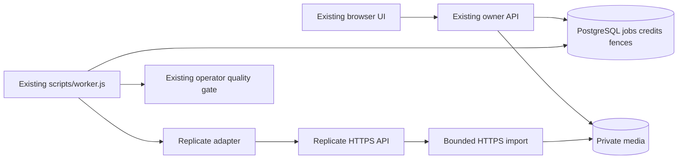

# F07 — Architecture and ADR proposal

Source: `e2dded9898d8b00f2fa5613e5f5d3fb63281715b`; 2026-10-03. XL /feature PLAN AUTO. Proposal for fresh independent validation, not accepted ADR. Mechanical route exit1/XL retained in per-unit evidence. Owner already authorized Replicate transition; no renewed plan permission requested. Spend remains0.

## Architecture Overview

Modular monolith plus existing PostgreSQL worker loop; only inference is hosted.

## ADR-F07-01 — Durable hosted depth inference

**Context.** Existing `web/generation.js` owns Engine JSON-lines transport, runClaim, heartbeat and artifact verification. `worker/engine.py` performs local fixture/controlnet generation; `worker/manifest.py` proves offline weight hashes, not hosted identity. `scripts/worker.js` only accepts fixture/controlnet and constructs Engine. `web/jobs.js` owns tickets, ordered locks, claims, lease retry, completion, release and deletion. `web/quality.js` assumes three40hex local revisions, known hardware/warm and measured-gpu-corpus-v1. `web/media.js` has10MiB/20MP private file guards. Existing DB migrations stop at006-sharing.sql. `scripts/maintenance.js` calls jobs.maintenance and sweep; extend that loop, do not create scheduler.

**Decision proposed.** Add explicit replicate adapter in Node worker, retain Python path unchanged. Use async HTTP create/get/cancel, persisted one-shot submission identity, and two validated imported images (depth/result). Choose `jagilley/controlnet-depth2img` version `922c7bb67b87ec32cbc2fd11b1d5f94f0ba4f5519c4dbd02856376444127cc60` as initial deployment contract candidate; immutable version/schema/license acceptance remains explicit configuration. Its actual depth conditioning is verified; geometry quality, safety filtering and runtime performance are not certified. There is no generic text-to-image substitution.

**Changed contracts, explicit consequences.**

- Introduce mode `replicate` and hosted evidence-v1; preserve old rows and validators. Hosted unknown hardware/warm become nullable under mode-specific DB checks. Do not populate fake local revisions/manifest hashes. Candidate returns depth so normalized depth evidence remains real; no synthetic depth placeholder.
- Preserve queue60s/attempt180s/job360s/lease30s/heartbeat10s and max2 ceiling. Narrow hosted retry eligibility: after submitting, no second create, even if failed/canceled. Reclaim known ID resumes same attempt with new fence, no ticket or deadline reset. This trades some availability for bounded charges and preserves all existing local-mode retry assertions.
- Replicate API response limit becomes512KiB only, due echoed≤256KiB binary data URI. Request≤384KiB, per-call5s; existing other-provider64KiB remains. This is a proposed SEC-02 specialization requiring accepted ADR/canonical update, not silent drift.
- Remote cancellation cannot enforce instantaneous remote stop, erasure or zero charge. Job deadlines remain local authority; Cancel-After covers provider starting/processing from creation. No billing guarantee is inferred from cancellation. Unknown outcome reserves conservative cost until operator reconciliation.
- Local hold policy stays exactly canonical: no newly authorized start/retry, already authorized attempt may finish private. Deletion immediately revokes app access and fences, asynchronously cancels remote known ID. Provider retention remains separate and must be disclosed before actual private-photo transmission.
- Existing mandatory local SD safety checker cannot be assumed in candidate source. Initial hosted code remains disabled for live user activation until explicit safety policy is accepted and its enforcement/evidence tested. Offline adapter implementation is independent. A curated licensed empty-room pilot needs documented operator content approval; it is not proof of automated production filtering. Do not quietly delete the old safety requirement.
- Existing warm GPU p95≤25s is not automatically replaced by provider advertised9s. Collect hosted end-to-end and provider timings; warm/hardware may remain unknown. Full performance gate remains pending; a future metric ADR, if needed, must explicitly change canonical PERF-03, never relabel unknown samples warm.

**Alternatives.** Generic prompt-only generation rejected: no geometry condition. Public input URLs rejected: broader media exposure. Hidden SDK create retries rejected: cannot bind remote effects after response loss. New queue/webhook orchestrator rejected: existing worker/maintenance provides bounded control. Local CUDA retained as explicit compatibility mode, no longer sole proposed deployment path. Data URI selected over uploads to avoid a separate durable file resource/deletion contract.

**Solution reasoning.** Root cause is a mismatch between killable local execution and remote chargeable execution. Database state cannot make HTTP exactly-once. Separate durable authorization, one-shot invocation, identity observation and fenced publication; sacrifice automatic replay on uncertainty. Reuse existing admission, release and maintenance. This is the minimum additional state needed to answer whether a paid invocation may already exist.

## Component Breakdown and exact implementation file ownership

All paths below relative to PROJECT_ROOT; one sequential Sol6.1 high writer per slice, coordinator owns final integration. New modules below are proposed, not currently present.

| File | Concrete change |
|---|---|
| db/007-replicate.sql | Add provider_submission and provider_spend_budget; unique job/prediction ID, immutable identity/deadline protections, mode-specific generation_evidence checks/nullability; no historical ledger rewriting |
| web/replicate.js | Fixed-origin create/get/cancel transport, status schema, bounded errors; no automatic POST retry |
| web/replicate-media.js | Data URI preparation/transform and bounded DNS-pinned output import; reuse media/boundedRead/hash helpers |
| web/provider-submissions.js | Transactional submission CAS, ID reconciliation, budget reservation, cleanup markers; no duplicated customer ledger logic |
| web/jobs.js | Hosted reclaim branch before generic retry, deadline terminal path, hosted complete validation, deletion cleanup marker; retain release uniqueness |
| web/generation.js | Dispatch hosted runClaim path, common private verification, commit-uncertainty orphan protection; local Engine interface preserved |
| scripts/worker.js | Explicit hosted configuration/adapter selection; no Python/GPU requirement in hosted mode |
| web/config.js | Only required mode/config availability checks; no secret in web serialization |
| scripts/maintenance.js | Invoke bounded provider cleanup using existing pass; no new timer service |
| web/quality.js | Hosted discriminated evidence/corpus validators; retain local/fixture checks and privileged bound review |
| web/sharing.js, web/composite.js, web/public-pages.js | Audit/adjust only hardcoded mode eligibility to shared quality predicate; preserve final hold/consent/hash checks |
| web/public/app.js | Only if actual display hardcodes modes: show hosted unverified/fixture labels, preserve CJM; confirm actual file via existing UI source before edit |
| .env.example, compose.yaml | Integration-owner-only names/runtime secret injection and hosted worker selection; no values, defaults disabled, no DB published ports |
| tests/replicate.test.js, tests/replicate-media.test.js | Transport/config/security/identity/output boundary tests with injected transport |
| tests/replicate.integration.test.js | Real PG crash/lease/hold/delete/ticket/spend races and publication safety |
| tests/replicate-quality.test.js | Hosted provenance/corpus negative and valid synthetic-software branch tests explicitly not real acceptance |
| scripts/mutation.js | Add targeted one-shot-submission mutation; preserve old owner/payment/budget/fixture controls |
| scripts/ui/browser-cases.js, scripts/ui/fixture-driver.js | Add deterministic hosted mock path for actual browser run; visibly synthetic, no paid calls |

`worker/engine.py`, `worker/manifest.py` and historical tests remain unchanged unless a concrete independent finding requires a separately scoped correction. Use built-in Node HTTPS/DNS/crypto plus existing sharp/pg; no SDK/package install needed. Worker modules keep dependencies injectable for zero-network tests.

## Technology Stack

| Layer | Technology | Rationale |
|---|---|---|
| Frontend | Existing native UI | Existing owner/status/media flow |
| Backend | Node22 ESM/http/https | Reuse worker; explicit retry/redirect behavior |
| Database/queue | Existing PostgreSQL16 | Single authority for fences/tickets/credits |
| Cache | Existing private artifacts only | No remote URL authorization cache |
| Inference | Replicate pinned community depth ControlNet | Verified input-image depth conditioning |
| Infrastructure | Existing isolated Compose | Hosted mode avoids CUDA requirement; deployment separate |

## External Dependencies

Quotes checked2026-10-03; see research for exact URLs and limitations. CONFIRMED means documented capability, never actual project acceptance.

| Capability needed | Provider / API | Evidence | Verdict | Requirements relying on it |
|---|---|---|---|---|
| Depth conditioning | Replicate model | [Model](https://replicate.com/jagilley/controlnet-depth2img): “use a depth map of an input image” · checked2026-10-03 | CONFIRMED | FR-f07-replicate-1 |
| Inline private input transport | Replicate HTTP | [HTTP](https://replicate.com/docs/reference/http): “Files should be passed as HTTP URLs or data URLs.” · checked2026-10-03 | CONFIRMED | FR-f07-replicate-4 |
| Pollable prediction identity | Replicate HTTP | [HTTP](https://replicate.com/docs/reference/http): “Get the current state of a prediction.” · checked2026-10-03 | CONFIRMED | FR-f07-replicate-2 |
| Request remote cancellation | Replicate HTTP | [HTTP](https://replicate.com/docs/reference/http): “Cancel a prediction” · checked2026-10-03 | CONFIRMED | FR-f07-replicate-3 |
| API content retention | Replicate retention | [Retention](https://replicate.com/docs/topics/predictions/data-retention): “automatically removed after an hour, by default” · checked2026-10-03 | CONFIRMED | FR-f07-replicate-4 |
| Exactly-once create or instant prediction API erasure | No such relied-on capability | HTTP reference does not establish either; requirements explicitly avoid reliance | UNCONFIRMED | None; not required for software implementation |
| Room geometry threshold, warm≤25s, safety filtering | Candidate deployment | Must be tested/accepted; read-only docs are insufficient | UNCONFIRMED | Real activation/acceptance of FR-f07-replicate-5 deferred; software guards may implement |

## Canonical updates only after plan acceptance

Coordinator updates `docs/Specification.md` (GEOM/JOB/SEC/PERF distinctions), `docs/Pseudocode.md` (submitting/reclaim/import), `docs/Architecture.md`, `docs/Refinement.md`, `docs/Completion.md`, `docs/ADR.md` (existing ADR catalog), `CLAUDE.md`, `docs/pipeline-walkthrough.md`, `docs/model-provenance-candidates.md`, `docs/features/f06a/operations.md`, `docs/test-scenarios.md`, `docs/features/f06a/acceptance-map.md`, `docs/README/en.md`, `docs/README/ru.md`. Preserve historical accepted evidence; add dated supersession/hosted status. This planner changes none of them.
