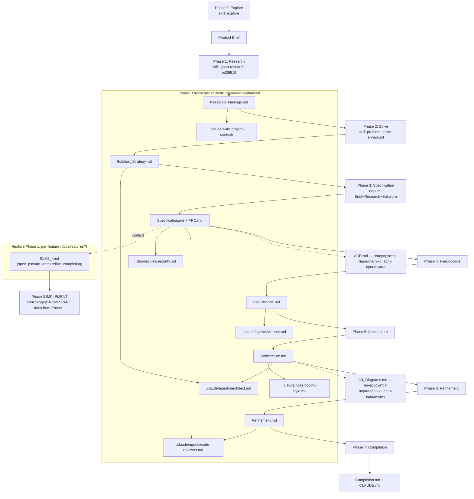

# Цепочка SPARC-документов и источник для кода в p-replicator

Метод: чтение исходников пайплайна (`.claude/commands/`, `.claude/rules/`,
`.claude/skills/`) + эмпирический тест на реальном требовании
`FR-GROWTH-003` из `projects/01-testimonials-senja/docs/`. Ничего не
додумано сверх того, что написано в файлах — где факта нет, это отдельно
помечено в разделе 6.

---

## 0. Прямой ответ на уточнённый вопрос (Модель А vs Модель Б)

**Верна Модель Б — КОМПЛЕКТ, не Модель А — ДИСТИЛЛЯЦИЯ.** Ни один документ не
поглощает содержание предыдущего и не делает его ненужным для кода. Это
доказывается тремя независимыми фактами, а не общими словами про методологию:

1. **Сам механизм фазы IMPLEMENT собирает не один файл, а пятёрку.**
   `.claude/commands/feature.md:73-77` — Phase 1 генерирует для фичи не
   «дистиллированную спеку», а пять документов сразу:
   `01_specification.md`, `02_pseudocode.md`, `03_architecture.md`,
   `04_refinement.md`, `05_completion.md`. Строка 103 того же файла:
   *«1. Read SPARC docs from Phase 1»* — во множественном числе, это чтение
   всей папки `docs/features/<feature>/`, а не одного файла.
2. **Лёгкий путь `/plan` читает два файла явно, а не один.**
   `.claude/commands/plan.md:31-34`:
   ```
   ### 2. Read Context
   - `docs/Architecture.md` — relevant subsystems
   - `docs/Specification.md` — requirements that touch this task
   ```
   Если бы Specification.md был самодостаточным, Architecture.md здесь был
   бы лишним — но он в списке обязательного контекста наравне со
   Specification.md.
3. **Генератор тулкита сканирует всю папку `docs/`, а не один файл**, и
   разным полям IPM (Internal Project Model) явно назначены разные
   документы-источники — см. раздел 3 ниже. Это архитектурно предполагает
   комплект, а не единый источник истины.

**Эмпирический тест (п.3 задания заказчика).** Требование `FR-GROWTH-003`
(«badge на free-тарифе нельзя снять») в `docs/Specification.md` содержит
только бизнес-правило (таблицу тарифов) и Gherkin-сценарии — **что** должно
быть верно. Чтобы это реализовать, реально нужно открыть ещё три файла:

| Файл | Что даёт для FR-GROWTH-003, чего нет в Specification.md |
|---|---|
| `docs/Architecture.md` §4.2-4.3 (строки 213-223) | **ГДЕ** считается решение: `/api/widget/config` читает `project.tier` **на сервере** и возвращает вычисленное поле `badge_required`; клиент это поле не решает. |
| `docs/Pseudocode.md` §5 (строки 229-281) | **КАК**: конкретные функции `renderBadge()`, `startBadgeIntegrityWatch()`, `checkAndRestore()`, формула `badge_required = (tariff == "free")`, механизм `MutationObserver` для защиты от `display:none` на самом узле. Ни имён функций, ни этой формулы, ни алгоритма слежения в Specification.md нет. |
| `docs/ADR.md` ADR-002 (строки 41-83) | **ПОЧЕМУ именно так**: почему `tier` вообще не передаётся клиенту, какие альтернативы отклонены (JWT-подпись, SSR-фрагмент) и какой риск сознательно остаётся не закрытым. Без этого ADR кодер с равной вероятностью реализует «прочитать tier на клиенте» — Specification.md такого запрета не формулирует явно. |

Убрать любой из трёх — и корректно реализовать FR-GROWTH-003 нельзя: без
Architecture неизвестно, где живёт проверка; без Pseudocode неизвестен
алгоритм и имена полей; без ADR кодер не знает, какие варианты уже
отклонены. Все три пересекаются по теме (badge), но каждый несёт свой
невзаимозаменяемый слой.

**Формулировка для аудитории (3-5 предложений):**

> В этом пайплайне документы не растворяются друг в друге — каждый следующий
> не заменяет предыдущий, а добавляет свой ракурс на одно и то же требование.
> Specification.md говорит, ЧТО должно работать и как это проверить тестом;
> Architecture.md — ГДЕ в системе живёт решение; Pseudocode.md — КАК это
> реализовать алгоритмически, вплоть до имён полей и функций; ADR — ПОЧЕМУ
> выбран именно этот вариант и что сознательно не решается. Мы проверили это
> не абстрактно, а на одном живом требовании (badge на бесплатном тарифе) —
> и без любого из трёх файлов реализация будет либо неполной, либо
> потенциально небезопасной. Поэтому это не дистилляция в один файл, а
> комплект: агент-кодер должен открыть несколько документов, а не один.

### Разбивка на две группы (по фактам, не по гипотезе)

**ОБЯЗАТЕЛЬНЫ ДЛЯ КОДА** (либо прямо читаются механизмом Phase 3 / `/plan`,
либо содержат информацию, без которой конкретный код нельзя написать
корректно — подтверждено тестом на FR-GROWTH-003):
- `Specification.md` — требования, AC, Gherkin-тесты (контракт «что проверять»)
- `Architecture.md` — где в системе размещена логика, поток данных, схема
- `Pseudocode.md` — алгоритмы, сигнатуры, имена полей/функций
- `ADR.md` — принятые решения и явно отклонённые альтернативы, ограничивающие реализацию

**СПРАВОЧНЫЕ / ИСТОРИЯ** (используются как контекст ДЛЯ ГЕНЕРАЦИИ других
артефактов, но фактически не открываются заново в момент кодирования):
- `PRD.md` — вход для Phase 1 sparc-prd-mini (бизнес-рамка), не для кодера напрямую
- `Solution_Strategy.md` — вход для `architect.md`/`project-context/`, архивный после этого
- `Research_Findings.md` — вход для `project-context/` skill, архивный
- `Refinement.md` — помечен OPTIONAL в `feature.md`; работает на Phase 4 (review) и `code-reviewer.md`, не на Phase 3
- `Completion.md` — вход для `/deploy`, не для написания кода фичи
- `C4_Diagrams.md` — не входит в список сканирования `01-detect-parse.md` для SPARC-пайплайна (раздел 3) — визуальный тупик

---

## 1. Граф зависимостей (по факту из sparc-prd-mini/SKILL.md, строки 89-135)



Порядок генерации внутри `docs/`: Explore → Research_Findings → Solution_Strategy
→ (Specification + PRD) → Pseudocode → Architecture → Refinement → Completion.
ADR.md и C4_Diagrams.md генерируются «если применимо» — их место в
последовательности не зафиксировано в SKILL.md жёстко (см. раздел 6).

---

## 2. Что буквально читает фаза реализации (с цитатами и номерами строк)

Два разных пути кодирования существуют в пайплайне, и оба читают НЕСКОЛЬКО
файлов, не один:

### Путь A — `/feature` (≥4 файлов, основной путь для фич)

`.claude/commands/feature.md:71-77`:
```
Generate per-feature SPARC docs in `docs/features/<feature>/`:
- `01_specification.md` — requirements + acceptance criteria
- `02_pseudocode.md` — algorithms + data flow
- `03_architecture.md` — component placement + dependencies
- `04_refinement.md` — edge cases + error paths
- `05_completion.md` — testing + deployment notes
```
`.claude/commands/feature.md:100-105` (Phase 3 IMPLEMENT):
```
1. Read SPARC docs from Phase 1
2. Identify independent work units
3. Spawn parallel `Task` tool calls, one per unit
```
Т.е. кодер открывает не project-level `docs/Specification.md`, а
СВЕЖЕСГЕНЕРИРОВАННЫЙ per-feature комплект из пяти файлов. Этот комплект, в
свою очередь, собирается sparc-prd-mini из project-level документов как
контекста (см. `feature.md:26-32`, Mode 2 prerequisites: `docs/PRD.md`
REQUIRED, `docs/Specification.md` RECOMMENDED «used for AC inheritance»,
`docs/Architecture.md` RECOMMENDED «used for component placement»).

Дублирующая формулировка в `.claude/rules/feature-lifecycle.md:91-93`:
```
1. Identify independent work units from Phase 1's Architecture
2. Spawn one Task per unit
3. Each Task: read SPARC sections + implement + test + commit
```
«Phase 1's Architecture» — это `03_architecture.md` из папки фичи, не
project-level `Architecture.md`. «read SPARC sections» во множественном
числе — подтверждает комплект, не один файл.

### Путь B — `/plan` (≤3 файлов, лёгкие задачи)

`.claude/commands/plan.md:31-34`:
```
### 2. Read Context
- `docs/Architecture.md` — relevant subsystems
- `docs/Specification.md` — requirements that touch this task
```
Здесь кодер читает ДВА project-level файла напрямую (без промежуточной
генерации per-feature версий) — Pseudocode/Refinement/Completion в этом
пути не упомянуты вовсе (лёгкие задачи предполагаются достаточно простыми,
чтобы алгоритм не нужен был отдельно).

### `/go` и `/run`

`.claude/commands/go.md` и `.claude/commands/run.md` НЕ читают документы
напрямую — они только маршрутизируют к `/plan` или `/feature` по шкале
сложности (`go.md`, Step 3-4) и делегируют. Собственного доступа к `docs/`
у них нет.

### Агенты-кодеры в `.claude/agents/`

В `.claude/agents/` пре-шипованы только пайплайн-агенты `replicate-coordinator.md`,
`product-discoverer.md`, `doc-validator.md`, `harvest-coordinator.md` —
ни один из них не является «агентом-кодером» и не содержит инструкций
читать конкретный SPARC-файл. Проектно-специфичные агенты `planner.md`,
`architect.md`, `code-reviewer.md` появляются только ПОСЛЕ Phase 3
`/replicate` (генерируются `cc-toolkit-generator-enhanced`). **В проекте
`01-testimonials-senja` каталога `.claude/agents/` вообще нет** — Phase 3/4
`/replicate` для этого проекта не запускались (см. раздел 6).

---

## 3. Что сканирует Phase 3 генератора тулкита (`01-detect-parse.md`)

Модуль сканирует **всю папку `docs/` целиком**, а не один файл. Список
буквально из `01-detect-parse.md:19-45` (SPARC-ветка): `PRD.md`,
`Solution_Strategy.md`, `Specification.md`, `Pseudocode.md`,
`Architecture.md`, `Refinement.md`, `Completion.md`, `Research_Findings.md`,
`Final_Summary.md`, `CLAUDE.md`.

Заметьте: **`C4_Diagrams.md` и `ADR.md` в этом списке для SPARC-пайплайна
НЕТ** (они relevant только для ветки `idea2prd`: `docs/c4/*.mermaid`,
`docs/adr/*.md` как отдельные пронумерованные файлы, не единый `ADR.md`).
Генератор тулкита в SPARC-режиме не парсит `ADR.md` и `C4_Diagrams.md`
вовсе, даже если они существуют в `docs/` — они вне его области видимости.

Извлекаемые поля и их источники (`01-detect-parse.md`, Step 3):
| Поле IPM | Источник(и) |
|---|---|
| `has_external_apis` | `Architecture.md`, `Specification.md`, `ADR-*-integration.md`, `context-map.md`, `repositories/*.md` |
| `has_database`, `db_type`, `orm_name` | `Architecture.md`, `Specification.md`, `docker-compose.yml`, `ADR-*-data.md`, `repositories/*.md` |
| `monorepo_packages` | **только** `Architecture.md` |
| `docker_services` | `Architecture.md`, `docker-compose.yml`, `Completion.md` |
| `has_pseudocode` | наличие `Pseudocode.md` (SPARC) или `docs/pseudocode/*.pseudo` (idea2prd) |
| `has_authentication` | ключевые слова "auth"/"login"/"JWT"/"OAuth" по всем документам |

Дальше (модули 02-05) разные документы явно назначены разным целевым
артефактам (`02-analyze-map.md:202-206`, `04-generate-p1.md`):
```
Architecture.md present  → architect.md (+10), /start (+10)
Pseudocode.md present    → planner.md (+10), BOOST /start P2
Refinement.md present    → testing.md (+8), code-reviewer.md (+8), /test (+8)
Solution_Strategy present→ project-context/ (+8), BOOST architect (+3)
Completion.md present    → /deploy (+8), BOOST /start P3
```
Это снова подтверждает Модель Б: каждому документу назначен свой,
неповторяющийся выход.

---

## 4. Разрыв «документ-источник» vs «документ-для-кода»

Специфичного разрыва между Specification.md и Pseudocode/Architecture НЕТ
в смысле «один главный, остальные не читаются» — факт из раздела 0-2:
все четыре (Specification, Architecture, Pseudocode, ADR) реально нужны
одновременно для конкретной фичи. Разрыв, который ЕСТЬ по фактам:

- **Refinement.md и Completion.md** — читаются не в момент написания кода
  фичи (Phase 3 IMPLEMENT), а на соседних фазах: Refinement — источник для
  Phase 4 REVIEW (`code-reviewer.md`, `testing.md`), Completion — источник
  для `/deploy`. `feature.md:29` прямо помечает их OPTIONAL для Mode 2.
- **PRD.md, Solution_Strategy.md, Research_Findings.md** — читаются один
  раз, на входе в генерацию (либо project-level PRD как REQUIRED context
  для sparc-prd-mini Phase 1, либо как источник для `project-context/`
  skill) и дальше не открываются повторно кодером.

---

## 5. Документы-тупики (никто не читает после генерации — по фактам)

| Документ | Почему тупик |
|---|---|
| `C4_Diagrams.md` (project-level, SPARC) | Отсутствует в списке сканирования `01-detect-parse.md` для SPARC-ветки (раздел 3) — генератор тулкита его не видит. Используется только людьми как визуальная референция. |
| `Final_Summary.md` | Единственное использование — fallback-источник для `project-context/` skill (`04-generate-p1.md:125-136`), только если нет `.ai-context/`. В проекте 01 этого файла нет вовсе — отсутствие не ломает пайплайн. |
| `Research_Findings.md` | Вход только для `project-context/` skill. После генерации не перечитывается ни `/feature`, ни `/plan`, ни `/go`. |
| `DIFF-discovery-vs-sparc.md` (проект 01) | Не входит в список 11 документов ни в одном SKILL.md/rules — рабочий артефакт конкретного прогона. |
| `docs/discovery/*`, `docs/validation/*` | Продукты Phase 0 и Phase 2-валидаторов; ни один SKILL.md фазы IMPLEMENT их не упоминает как вход. |

---

## 6. Что я НЕ смог установить и почему

1. **Реальный прогон Phase 3/4 `/replicate` на проекте 01 отсутствует.**
   В `projects/01-testimonials-senja/` нет `.claude/`, `feature-roadmap.json`,
   `docs/features/`. Агент-кодер по факту НИКОГДА не запускался на этом
   проекте — анализ разделов 1-4 основан на механизме пайплайна (что
   ОБЯЗАН прочитать кодер по написанным правилам), а не на логе реального
   запуска. Цитату «агент открыл файл X в 14:32» привести не могу.
2. **Точное место ADR.md и C4_Diagrams.md в последовательности генерации.**
   `sparc-prd-mini/SKILL.md` описывает 8 фаз (0-7) без явного шага для
   ADR/C4 — в `replicate.md` они упомянуты в списке «11 документов» без
   номера фазы. Не могу подтвердить, генерируются ли они параллельно
   Specification/Architecture или отдельным проходом.
3. **Согласованность per-feature `03_architecture.md` с project-level
   `Architecture.md` в момент кодирования** — правило говорит «Read SPARC
   docs from Phase 1» (per-feature), но не уточняет, обязан ли агент ТАКЖЕ
   заново открыть project-level `Architecture.md`. Это неопределённость
   самого правила, не моя догадка.
4. **`.ai-context/*` путь (idea2prd-ветка)** не проверялся эмпирически на
   проекте 01 — он использует чистый SPARC, а не idea2prd-manual.
